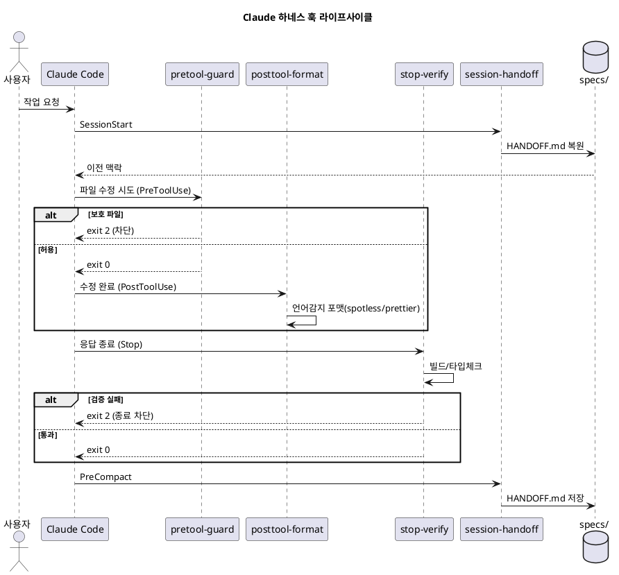

# Claude 하네스 템플릿 — 구조 · 기능 · 사용 매뉴얼

> 언어 무관 드롭인 하네스(Java/Spring · React/Next 공통). 프로젝트 루트에 복사해 사용.
> 산출물: `claude-harness-template.tar.gz` (27파일)
> 작성 2026-06-26 · 훅/settings 문법 검증 완료

---

## 0. 이 템플릿이 하는 일 (결론 먼저)

하네스의 **3기둥**을 파일로 구현한 뼈대다. 스택을 가리지 않고, 훅이 **파일 확장자로 언어를 감지**해 Java·React를 한 벌로 커버한다.

| 기둥 | 구현 파일 | 역할 |
|------|----------|------|
| 제약(Constraints) | `CLAUDE.md` + `.claude/rules/*` + `pretool-guard.sh` | 위험·금지 동작 차단 |
| 피드백(Feedback) | `posttool-format.sh` + `stop-verify.sh` + `.claude/agents/*` | 포맷·빌드·검증 |
| 상태(State) | `session-handoff.sh` + `specs/` | 세션 인계·SDD 산출물 |

---

## 1. 디렉토리 구조

```
claude-harness-template/
├── CLAUDE.md                     # 제약: 전역 가드레일 (3기둥·스택감지)
├── AGENTS.md                     # 에이전트 공통 표준
├── RULES.md                      # 룰 인덱스
├── README.md                     # 삽입·사용법
├── specs/                        # 상태: SDD 산출물 + HANDOFF/DECISIONS
│   └── README.md
└── .claude/
    ├── settings.json             # 훅 등록 (Pre/Post/Stop/Session/PreCompact)
    ├── hooks/                    # 언어 자동감지 훅 4종 (완성)
    │   ├── pretool-guard.sh
    │   ├── posttool-format.sh
    │   ├── stop-verify.sh
    │   └── session-handoff.sh
    ├── skills/
    │   ├── handoff/SKILL.md
    │   └── changelog/SKILL.md
    ├── commands/                 # plan·verify·review·commit·harness-audit
    ├── agents/                   # evaluator·code/security/silent-failure/state-reviewer
    └── rules/
        ├── common/               # security·testing·git-workflow (paths: **/*)
        ├── java-spring/          # patterns (paths: **/*.java)
        └── react-next/           # patterns (paths: **/*.ts, **/*.tsx)
```

---

## 2. 파일별 기능

### 2.1 루트 문서

| 파일 | 기능 | 커스터마이징 |
|------|------|-------------|
| `CLAUDE.md` | 전역 가드레일·3기둥·스택 감지 규칙 | "절대 금지"에 프로젝트 도메인 규칙 추가 |
| `AGENTS.md` | 에이전트 공통 규약·에스컬레이션 포맷 | 역할 정의 조정 |
| `RULES.md` | 룰 위치 인덱스 | 스택 추가 시 행 추가 |

### 2.2 훅 (`.claude/hooks/`) — 완성됨, 핵심 자산

| 훅 | 이벤트 | 동작 | 종료코드 |
|----|--------|------|---------|
| `pretool-guard.sh` | PreToolUse | `.env`·시크릿·prod설정·마이그레이션 수정 **차단** | 차단 시 **`exit 2`** |
| `posttool-format.sh` | PostToolUse | 확장자 감지: `.java`→spotless, `.ts/.tsx`→prettier | 0 (후처리) |
| `stop-verify.sh` | Stop | 스택 감지: gradle compile / tsc --noEmit | 실패 시 **`exit 2`** |
| `session-handoff.sh` | SessionStart / PreCompact | `specs/HANDOFF.md` 저장·복원 | 0 |

> **핵심 원리**: 차단은 반드시 `exit 2`. `exit 1`은 비차단으로 처리되어 위험 동작이 그대로 진행된다. 훅은 stdin JSON을 `jq`로 파싱한다(환경변수 방식 아님).

### 2.3 스킬 (`.claude/skills/`)

| 스킬 | 트리거 | 산출물 |
|------|--------|--------|
| `handoff` | 세션 종료·컨텍스트 압축 직전 | `specs/HANDOFF.md` |
| `changelog` | 아키텍처·의존성·API 계약 변경 | `specs/DECISIONS.md` (append-only) |

### 2.4 커맨드 (`.claude/commands/`)

| 커맨드 | 용도 |
|--------|------|
| `/plan` | 작업을 완료 기준(SC) 단위로 분해 → `specs/` |
| `/verify` | SC·빌드·타입·테스트 대조 검증 |
| `/review` | 타입·보안·예외·상태 관점 검토 |
| `/commit` | Conventional Commits 메시지 준비 |
| `/harness-audit` | 3기둥 구성 누락 자가 점검 |

### 2.5 에이전트 (`.claude/agents/`)

| 에이전트 | 모델 | 검증 대상 |
|----------|------|----------|
| `evaluator` | sonnet | SC 충족·타입/계약 안전성 (Generator와 분리) |
| `code-reviewer` | sonnet | 가독성·구조·중복·에러처리 |
| `security-reviewer` | sonnet | 시크릿·인증/인가·인젝션 |
| `silent-failure-hunter` | haiku | 빈 catch·무시된 에러 |
| `state-reviewer` | sonnet | 상태 경계·리렌더·트랜잭션 경계 |

### 2.6 룰 (`.claude/rules/`) — 경로(glob)로 자동 적용

| 위치 | paths | 예시 규칙 |
|------|-------|----------|
| `common/` | `**/*` | 시크릿 금지·red→green·Conventional Commits |
| `java-spring/` | `**/*.java` | @Transactional 내 외부호출 금지·Entity 직접반환 금지·LAZY |
| `react-next/` | `**/*.ts,tsx` | any 금지·fetch 직접호출 금지·상태 경계 |

---

## 3. 훅 라이프사이클 (PlantUML — 복사해서 렌더)



---

## 4. 사용 예제 (스텝 바이 스텝)

### 4.1 설치 (드롭인)

```bash
# 1) 템플릿을 프로젝트 루트에 복사
tar -xzf claude-harness-template.tar.gz
cp -R claude-harness-template/. /path/to/your-project/

# 2) 훅 실행 권한
chmod +x /path/to/your-project/.claude/hooks/*.sh

# 3) 전제 도구 확인
jq --version        # 훅 파싱
pnpm -v             # 프론트 포맷/타입
./gradlew -v        # 백엔드 빌드 (있는 경우)
```

### 4.2 GSD로 하네스 구성 (SDD 워크플로우)

```bash
# 프로젝트 루트에서 GSD 설치 (온라인)
npx get-shit-done-cc --local

# 워크플로우
/gsd:new-project     # 아이디어 → 스펙
/gsd:create-roadmap  # 마일스톤
/gsd:plan-phase      # 완료 기준(SC) 정의 → specs/
/gsd:execute-plan    # 구현 (훅이 포맷·검증 자동 개입)
/gsd:verify          # SC 대조
```

### 4.3 실제 시나리오 — "로그인 폼 추가" (Java+React 혼합)

```
1) /plan "OAuth 구글 로그인 폼 추가"
   → specs/ 에 SC 기록 (예: 유효토큰=200, 무효=401)
2) 구현 시작
   → backend/*.java 수정 → posttool-format 이 spotless 적용
   → frontend/*.tsx 수정 → prettier 적용
   → .env 수정 시도 → pretool-guard 가 exit 2 로 차단
3) 응답 종료
   → stop-verify 가 gradle compile + tsc --noEmit 실행
   → 깨지면 exit 2 로 종료 차단
4) /review → security-reviewer 가 시크릿·인가 누락 점검
5) /verify → specs/ 의 SC 대조
6) 컨텍스트 압축 직전 → session-handoff 가 HANDOFF.md 저장
```

### 4.4 자가 점검

```
/harness-audit
→ settings.json 훅 등록·rules 로드·specs 존재를 3기둥별로 점검
```

---

## 5. 커스터마이징 가이드

| 하고 싶은 것 | 수정 위치 |
|-------------|----------|
| 도메인 금지 규칙 추가 | `CLAUDE.md` "절대 금지" |
| 포맷터 변경(예: biome) | `posttool-format.sh` case 분기 |
| 검증 명령 변경(테스트 추가) | `stop-verify.sh` |
| 새 스택 추가(예: Python) | `.claude/rules/python/` + 훅 case 추가 |
| 에이전트/스킬 본문 채우기 | ECC(`affaan-m/ECC`) 동명 자산 복사 |

> **뼈대 → 완성**: 스킬·에이전트는 스텁이다. 본문은 ECC의 `strategic-compact`·`recursive-decision-ledger`·`agents/*` 등에서 가져와 채운다.

---

## 6. 할루시네이션 / 출처 검증

| 항목 | 상태 | 근거 |
|------|:---:|------|
| 훅 4종 문법 | ✅ | `bash -n` 통과 |
| settings.json (hooks 복수배열·deny) | ✅ | `json.load` + 프로젝트 hooks 가이드 |
| 차단 `exit 2` / 훅 stdin JSON(jq) | ✅ | 세션 내 공식 docs 확인 + 프로젝트 자료(환경변수 방식은 구식) |
| 훅 이벤트(Pre/Post/Stop/SessionStart/PreCompact) | ✅ | 프로젝트 `claude-code-hooks-guide` + 공식 docs |
| SKILL/agents/rules frontmatter | ✅ | 27파일 점검 |
| GSD `npx get-shit-done-cc` + repo | ✅ | 프로젝트 자료 + repo HTTP 200 |
| 3기둥·`.claude/` 규약 | ✅ | 프로젝트 `api-portal-harness-essentials` + 강의 LEVEL 7·9 일치 |
| `rules/`의 `paths:` frontmatter 신뢰성 | ⚠️ 재확인 | Claude Code 버전별 로딩 편차 — 핵심 규칙은 CLAUDE.md 중복 권장 |
| 훅 문법·이벤트 최신성 | ⚠️ 재확인 | 버전별 변동 — 도입 시 `/hooks`로 확인, code.claude.com/docs/en/hooks 대조 |

**참고 출처**: Claude Code 공식 문서(code.claude.com/docs/en/hooks), ECC(github.com/affaan-m/ECC, MIT), GSD(github.com/gsd-build/get-shit-done), 프로젝트 내부 자료(클로드 코드 마스터).

> ⚠️ 이 매뉴얼의 훅/스킬 규약은 작성 시점 기준이며, Claude Code는 버전에 따라 문법이 바뀔 수 있으므로 도입 전 `/hooks`·`/skills`로 현행 확인을 권장한다.
