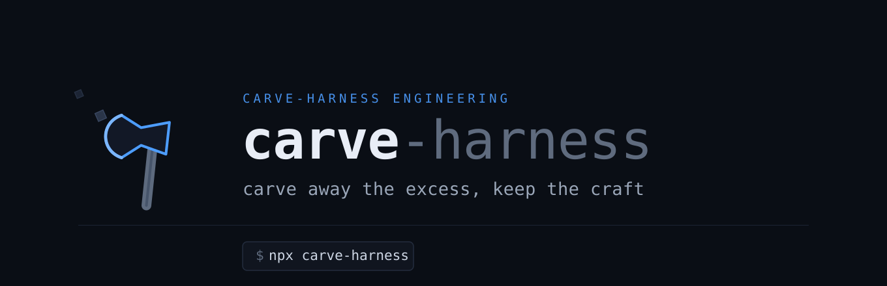

<p align="center">
  
</p>

<p align="center"><b>Keep what's essential. Carve away the rest.</b></p>

# Claude Harness (language-agnostic drop-in)

[한국어](README.md) · Current version **v0.10.0** · Changes: [CHANGELOG.md](CHANGELOG.md) · Course: [HARNESS_GUIDE.md](HARNESS_GUIDE.md) (Korean)

A guardrail template that stops coding-agent rule violations with **hook exit 2 blocking** — not persuasion.
Drop it into your project root and it works immediately.

## Features

| Pillar | Behavior |
|--------|----------|
| **Constraints** | PreToolUse hook blocks writes to protected paths (`.env`, prod configs, migrations) and hardcoded secrets. Fail-closed when jq is missing or JSON is malformed. **Gate self-protection** — in an installed harness the hooks, `settings.json` and manifest cannot be edited or deleted either (the agent cannot switch the gates off) |
| **Feedback** | Stop hook blocks "done" claims while build/type/lint/tests fail — incremental, changed stacks only (Java, Node/TS, Python, Go, Rust, bash; each runs only when its toolchain is installed, bringing CI's `npm run lint` local) |
| **State** | Handoff auto-saved at session end/compaction (real TODOs and decisions), restored at start |
| **Observability** | Every hook verdict logged to `logs/*.jsonl` (PII masked), with report/rotation. The session-start banner lists every loaded component, and all hook messages carry a unified `[carve-harness:<hook>]` prefix |
| **Self-audit** | `/harness-audit` — 71 mechanical checks PASS/FAIL the harness configuration itself (pack integrity + eval maturity included) |
| **Language packs** | At install time only the detected packs among typescript · java-spring · python · go · rust · database land — rules, verification gate, scoring adapter, golden-set starter and LSP as one set. Unselected languages have no files at all |
| **Verify loop** | `/verify-loop` — grades each claimed implementation 0–100 against real code, feeds gaps back to rework anything under 95, loops until every item passes. Stop hook blocks "done" while any item is unresolved → [verify-loop guide](docs/md/verify-loop-guide.md) |
| **Quantitative eval** | `/eval` — re-runs a fixed golden set k times for pass@k/pass^k, a score trend and regression detection. `carve-validate` separates golden-set config errors first, at zero agent cost |

**Inventory**: 20 hooks (5 event gates · 3 libraries · 12 CLI/helpers) · 6 stack definitions (`.claude/stacks/`) · 6 language packs (`packs/`) · 14 slash commands · 7 agents · 10 skills · 11 rule files (+10 stack references in `docs/rules/`) · 3 workflows · 20 golden-set starters · 30 test suites (503 cases) — full lists in the [component tables](#full-component-list-skills--commands--hooks) below

**Cross-agent**: hook blocking is Claude Code-only. Cursor/Codex/etc. follow `AGENTS.md` as the canonical rules, with `.githooks/pre-commit` as the final gate at commit time.

## Which projects it fits

This harness **enforces with hooks**. It earns its keep only where there is a place to enforce.

| Requirement | Why | Without it |
|---|---|---|
| Developing with **Claude Code** | PreToolUse/Stop hooks are the only place that blocks with exit 2 | Cursor/Codex/Aider get `AGENTS.md` rules + `.githooks/pre-commit` only — enforcement moves to commit time |
| A **git repository** | Incremental verification (which stacks changed), the commit gate, update/rollback backups | Falls back to full verification, no commit gate |
| **jq** | Every hook reads its stdin JSON with jq (fail-closed when missing) | The installer tries to place `~/.local/bin/jq`; if that fails, install aborts |
| A supported stack **with its toolchain** | The Stop gate and scorer actually run `tsc/npm`, `gradlew`, `ruff/pytest`, `go`, `cargo` | A stack without its toolchain is skipped best-effort (not blocked) — `eval-score` lists it under `skipped` |
| Someone who **maintains the golden set** | `/eval` and CI block mode only mean something when a human reviews cases | Use gates + verify loop, hold off on `/eval` |

**Good fit** — a service codebase in one or more of TypeScript/React/Next · Java/Spring · Python/FastAPI · Go · Rust, with a test runner, PR-based work, and an agent writing code several times a day. Paths where a mistake is an incident (gateway, payments, auth) get the most out of the verify loop and golden set.

**Partial** — teams whose toolchains live only in CI (local gates skip, `eval-gate` still runs in CI) · single-script or notebook repos (only the protected-path/secret/dangerous-command guards apply) · monorepos (per-stack gates work, but detection covers the root plus one level such as `backend/`, `frontend/`).

**Not a fit** — Ruby · PHP · C# · Swift · Dart as the main language (no gate — one stack file per `GUIDE.md` §8.2 adds one) · directories without git · native Windows shells (WSL required) · research/documentation repos where the agent rarely writes code (nothing for the verify loop or golden set to measure).


> **Demo**: <a href="https://claude-code-expert.github.io/carve-harness/docs/html/harness-demo/index.html" target="_blank" rel="noopener noreferrer">before/after screen comparison (new window)</a> — the same prompt rendered without the harness (slop) and with it (clean), side by side, with a table mapping each change to the rule that forced it.

## Install

```bash
cd /path/to/your-project
curl -fsSL https://raw.githubusercontent.com/claude-code-expert/carve-harness/main/install.sh | bash
```

- **Project-aware build (recommended)**: at install start you're asked `[1] Analyze the project and build a tailored harness / [2] Manual component selection`. `[1]` full-installs, then running `/carve-harness-create` in a Claude Code session analyzes your stack and proposes/prunes rules, agents, and skills that don't fit — shrinking the always-loaded token surface (fully functional before pruning too). `[2]` is the checkbox list below. (env / non-interactive installs skip this prompt.)
- **Component selection**: before installing, every item is listed as checkboxes grouped by section (required md / hooks / skills / commands / orchestrator). `↑↓`/`jk` to move · Space to toggle (on a section row, toggles all children) · `1`-`5` to jump to a section · `a` to toggle all · Enter to install. Default is everything selected — just press Enter for a full install. Non-interactive: `HARNESS_COMPONENTS=md,hooks bash install.sh`. The selection is recorded in `.claude/harness-components`, drives update-mode filtering, and re-running adds missing items.
- Existing files are never touched (reported as SKIP) — installed paths are recorded in `.claude/harness-manifest.txt`.
- **Exception: `.claude/settings.json` is merged, not skipped** — your existing config (`permissions`, `model`, own hooks) is preserved while the harness's 6 hook events plus LSP/plugin declarations are registered via jq (idempotent). Skipping it would leave the hooks unregistered and every gate (banner, guard, verify) inert.
- **LSP + plugins auto-declared**: settings.json declares the `vtsls` (TypeScript/React/JavaScript LSP), `jdtls` (Java LSP), `ponytail`, and `frontend-design` (design-direction skill) plugins along with their marketplaces (`claude-code-lsps` · `ponytail` · `claude-code-plugins`) — Claude Code installs them after a trust prompt at session start. Server binaries are separate: `bash install.sh setup` offers a global npm install of vtsls; jdtls needs `brew install jdtls` (JDK required). Missing binaries are reported as NOTE lines at the end of install.
- The installer ends by running `/harness-audit` — 0 failed means all gates are live (the check count depends on the installed packs).
- **Language packs**: interactively, one prompt after the component menu (detected packs pre-selected, Enter = detected). Non-interactive `HARNESS_PACKS=auto|none|all|typescript,python` (unset = auto). Later: `bash install.sh pack list|add <name>|remove <name>`.

### Language packs

The installer lands **only the detected languages**. One pack = rules (`.claude/rules/<stack>/`) + verification gate · formatter · scoring adapter (`.claude/stacks/<pack>.sh`) + 4 golden-set starters (`specs/goldenset/starters/`) + an LLM-judge example (`docs/evaluator/`) + an LSP plugin toggle. An unselected pack has no files, so neither its rules nor its gates load.

| Pack | Detection markers | Gate · format | LSP |
|---|---|---|---|
| `typescript` | `package.json` · `tsconfig.json` | `tsc --noEmit` · `lint`/`test` scripts · prettier | vtsls |
| `java-spring` | `gradlew` · `build.gradle(.kts)` · `pom.xml` | gradle compile/test (gateway-only changes run `*GatewayIntegration*` incrementally) · spotless · `eval-java` scorer | jdtls |
| `python` | `pyproject.toml` · `requirements.txt` · `setup.py/cfg` | ruff check · pytest · ruff format | pyright |
| `go` | `go.mod` | go build/vet/test · gofmt | gopls |
| `rust` | `Cargo.toml` | cargo check/test · rustfmt | rust-analyzer |
| `database` | an ORM in a dependency manifest (prisma · drizzle · typeorm · sqlalchemy · JPA · gorm · diesel · sqlx …) | rules only (`database.md` · ORM reference) | — |

```bash
HARNESS_PACKS=auto bash install.sh                 # detected packs (default when there is no tty)
HARNESS_PACKS=typescript,python bash install.sh    # explicit
HARNESS_PACKS=none bash install.sh                 # core only — guards, handoff, audit, no language gates
bash install.sh pack list                           # pack | installed | detected | summary (missing paths flagged)
bash install.sh pack add go                         # add later (online or HARNESS_SRC_DIR)
bash install.sh pack remove java-spring             # remove → backed up, restore with bash install.sh rollback
```

**On any full install** (project-aware `[1]`, non-interactive `curl | bash`/env, or manual with everything selected) the installer prints the banner below at the end, pointing you to run `/carve-harness-create` in a session (it fires **only via the slash command**, not a natural-language request). The installer output is in Korean:

```text
┌─────────────────────────────────────────────────────────────┐
│  맞춤 하네스 구축 예약됨 — 전체 설치 완료, 지금 바로 동작    │
└─────────────────────────────────────────────────────────────┘
프로젝트를 분석해 이 스택에 맞는 하네스로 최적화하려면
Claude Code 세션에서 다음을 실행하세요:

    /carve-harness-create

스택을 감지해 맞지 않는 구성을 제안하고, 1회 확인 후 덜어내 최적화합니다.
최적화하지 않아도 하네스는 정상 동작합니다(전체 구성 유지).
```

On a partial install that excludes the `carve-harness-create` skill, this banner is replaced by a `bash install.sh setup` (interactive initial setup) hint instead.

### Offline / local clone install

```bash
HARNESS_SRC_DIR=/path/to/harness bash /path/to/harness/install.sh          # install
HARNESS_SRC_DIR=/path/to/harness bash /path/to/harness/install.sh update   # update
```

To pull from a different source, set `HARNESS_REPO=<owner>/<repo>` · `HARNESS_REF=<branch|tag>`.

**Initial setup** (optional, every prompt skippable with Enter):

```bash
bash install.sh setup
```

git init · jq PATH · LICENSE generation (MIT/Apache-2.0) · extra protected paths · domain-rule collection · stack detection report · GSD install offer.
For domain rules and per-stack gates, see `GUIDE.md` §8.

## First run (post-install setup · language packs)

After install, walk this order once and the harness fits your project. Steps 1–3 already give you every guard and gate.

1. **Install** — `curl … | bash`. Pick `[1] project-aware build (recommended)` at the prompt: it full-installs, then guides the stack trim.
2. **Confirm language packs** — the detected packs land by default. Adjust later:
   ```bash
   bash install.sh pack list                 # pack | installed | detected | summary
   bash install.sh pack add python           # add a pack detection missed
   bash install.sh pack remove java-spring   # drop one you don't need (backed up → rollback)
   ```
3. **Machine prep + initial setup** — `jq`, `git`, and the stack toolchains (`tsc`, `gradlew`, `ruff/pytest`, `go`, `cargo`) must be present for the gates to actually bite.
   ```bash
   bash install.sh setup    # git init · jq PATH · LICENSE · protected paths · domain-rule collection · stack report
   ```
4. **Tailor to the stack (optional)** — run `/carve-harness-create` in a Claude Code session. It proposes pack add/remove and prunes agents/skills you don't need, applied **after one confirmation**. Shrinks the always-loaded tokens.
5. **Domain rules** — three project invariants under "도메인 규칙" in `CLAUDE.md` (e.g. "order amount never negative"). Hooks can't see code patterns — **enforce these with tests**.
6. **Verify** — `/harness-audit` at `0 failed` means every gate is live; it also checks language-pack integrity (AUDIT-09) and eval maturity.
7. **Just work** — protected paths, secrets and dangerous commands are blocked automatically; on response end only the changed stacks build and test; `specs/HANDOFF.md` is saved and restored at session boundaries.
8. **(after 1–2 weeks) golden-set setup** — once real failures exist, run `/eval-init` once: an interview fixes the eval/quality gates and builds the golden set. Then track regressions with `/eval`.

> For which tool to use when, see the [end-to-end workflow](#end-to-end-workflow--which-tool-when) table below; for the folder layout, see each directory's `README.md`.

## Update / Rollback

Run every command **from the target project root**.

```bash
# Check the installed version
cat .claude/harness-version

# Update — online (recommended)
curl -fsSL https://raw.githubusercontent.com/claude-code-expert/carve-harness/main/install.sh | bash -s -- update

# Update — using the locally installed installer
bash install.sh update

# Update — offline (point at a copy of the new version)
HARNESS_SRC_DIR=/path/to/new-harness bash install.sh update

# Pin a branch/tag
curl -fsSL https://raw.githubusercontent.com/claude-code-expert/carve-harness/main/install.sh | HARNESS_REF=v0.0.4 bash -s -- update

# Force re-patch of the same version (file recovery)
HARNESS_FORCE=1 bash install.sh update

# Rollback — restore previous version (no network; run again to step further back)
bash install.sh rollback
```

- update: compares remote `VERSION` vs local `.claude/harness-version` (no-op if equal) → patches manifest scope only; changed files are auto-backed up to `logs/harness-backup/v<prev>/`; user files (SKIPped at install) are inviolate.
- rollback: restores the latest backup and reverts the version stamp. Backups are consumed — run again to step further back.
- prune: `bash install.sh prune --keep-list <file>` — removes only the components that don't fit the project (core hooks and cross-agent entry files are refused); removed files are backed up under `logs/harness-backup/` and restorable via `rollback`. Usually invoked automatically by the `/carve-harness-create` skill after analysis.
- Release procedure: `RELEASE.md`.

## Uninstall

```bash
bash uninstall.sh          # dry run — prints what would be removed
bash uninstall.sh --yes    # actually remove (manifest scope only; pre-existing files are safe)
```

## Usage

Once installed, the gates are automatic — protected-path writes are blocked, only changed stacks are verified when a response ends, and state is saved at session boundaries. Manual tools:

| Command | Purpose |
|---------|---------|
| `/harness-audit` | PASS/FAIL of the harness configuration (AUDIT-01~09, 71 checks in this repo) |
| `/plan` `/verify` `/review` `/commit` | SC breakdown · SC verification · code review · commit→pull→push with your message |
| `/verify-loop <goal>` | For multi-requirement work — grades each item 0–100 and reworks until all pass 95 |
| `/eval-init` | **Once, after install** — analyzes the project and fixes the eval/quality gates through an interview, then builds the golden set |
| `/eval` | Re-score the golden set → pass@k/pass^k · append to the score trend · regression vs baseline |
| `bash .claude/hooks/carve-validate.sh [--red]` | Golden-set preflight — structural validation at zero agent cost; `--red` also checks that a case measures anything at all |
| `bash .claude/hooks/eval-gate.sh --mode report\|block [--delta N]` | Judge regression from the score trend alone (no LLM). `block` exits 1 past the tolerance — this is what CI calls |
| `bash .claude/hooks/logs-report.sh [days]` | hook verdict log summary (`--rotate N` to rotate · `--tokens N` per-session token usage) |
| `npm test` / `npm run test:install` | all 30 hook test suites (503 cases) / installer component-selection suite |
| `bash install.sh pack list\|add\|remove` | language-pack status table / add / remove (backed up → `rollback`) |
| `bash .claude/hooks/eval-score.sh` | build-health scorecard `specs/SCORE.json` — G1 build · G2 tests · G3 safety (veto) + lint · regression · coverage, no LLM |

For customization (protected paths, formatters, verify commands, new stacks) and the full reference, see **`GUIDE.md`**.

## End-to-end workflow — which tool, when

| Step | When | What | Gate / artifact |
|---|---|---|---|
| 0 Install | Once | `curl … \| bash` → language packs detected → `harness-audit` runs | 6 hook events registered · `.claude/harness-manifest.txt` · `harness-packs` |
| 1 Tailor | Right after install | `/carve-harness-create` — proposes pack add/remove from detection + prunes agents/skills you don't need (one confirmation) | `install.sh pack …` / `prune` (backed up → `rollback`) |
| 2 Domain rules | Right after install | `bash install.sh setup` or three invariants under "도메인 규칙" in `CLAUDE.md` ("order amount never negative" …) | Hooks cannot see code patterns — invariants are **enforced by tests** |
| 3 Daily work | Every response | Just code. PreToolUse blocks protected paths, secrets and dangerous commands; files are formatted on write; on response end **only the changed stacks** build, lint and test | exit 2 blocking · verdicts in `logs/*.jsonl` |
| 4 Plan & verify | Per feature | `/plan` → implement → `/verify` · `/review` (delegates to security-reviewer) | `specs/` success criteria (SC) |
| 5 Verify loop | Many requirements at once | `/verify-loop <goal>` — grades each item 0–100 against real code, reworks only items under 95 | `specs/checklist.json` · `checklist-gate` blocks "done" while items remain |
| 6 Health score | Before a PR / in review | `bash .claude/hooks/eval-score.sh` — build · tests · safety (veto) + lint · regression · coverage | `specs/SCORE.json` (unmeasurable items listed as `skipped`) |
| 7 Golden set setup | Once, after 1–2 weeks of use | `/eval-init` — 7-question interview, seeds drafts from the installed packs' starters, trajectory check, only approved cases land | `specs/goldenset/*.json` · `.github/workflows/eval-gate.yml` (report) |
| 8 Regression tracking | Whenever prompts, rules or models change | `carve-validate --red` → `/eval` → `eval-gate --mode report\|block` | `specs/eval-score.json` trend · `[REGRESSION]` · `[VERSION CHANGED]` |
| 9 Operate | Periodically | `logs-report.sh 7` to mine blocks/failures → add cases · `/harness-audit` · `install.sh update` | The compounding loop: failures become golden-set cases |

Session boundaries are automatic — `specs/HANDOFF.md` is saved on end/compaction and restored on start with a banner of the loaded components. Steps 6–8 are optional; 0–5 alone give you every guard and gate.

## Orchestration & the verify loop

Three higher-level workflows sit on top of the single-session guards: **Fable teams**, which split work across role-specific agents; the **verify loop (Eval)**, which scores each spec requirement against the real implementation; and **golden-set eval (carve-eval)**, which tracks output quality over time against a fixed case set. None is tied to a specific model — without Fable 5, an opus/sonnet session or Cursor/Codex runs the same SOP by hand. Fable 5 just performs it as a default reflex.

### Fable teams — multi-agent orchestration

**What** — the main session (orchestrator, Fable 5 · xhigh tier) breaks work into 3–5 tasks, hands each to a role-specific worker, and synthesizes the results. Workers hold non-overlapping file ownership (`owns` globs) and run in isolated worktrees, so they parallelize without colliding. The builder and the evaluator are never the same agent.

| Role | Agent | Owns |
|------|-------|------|
| Direct · split · synthesize | main session | phase design, approval gate, synthesis |
| Research | `fable-researcher` | official-docs research → RESEARCH.md |
| Build | `fable-builder` | implementation + tests (worktree-isolated) |
| Docs | `fable-doc-writer` | README, guides, API docs |
| Diagrams | `fable-visualizer` | diagrams, mockups |
| Verify | `evaluator` | pass/fail against success criteria (read-only) |

Four phases (run automatically by the `fable-team-pipeline` workflow):

```
P1 Spec      research → split into 3–5 tasks (owns + acceptance required)
P2 Build     per-task builder (worktree) → evaluator verifies on completion   [barrier-free pipeline]
P3 Document  doc-writer + visualizer in parallel
P4 Verify    evaluator's final SC judgment
```

**How to use**

| Goal | What to say |
|------|-------------|
| Single delegation | "have fable-researcher check Next.js 16 caching" / "give src/api to fable-builder" |
| Full pipeline | "run fable-team-pipeline for 'order-cancel API + docs + flow diagram'" — opt-in, so include the `ultracode` keyword or name the workflow |
| Depth control | "run fable-team-pipeline with a +300k budget" — fan-out scales to the budget |
| Cross-worker consensus | `CLAUDE_CODE_EXPERIMENTAL_AGENT_TEAMS=1` + "make a team" — builders flag each other when their contracts diverge |

**Effect** — the bottleneck is verification, not code generation. Delegating exploration and review to subagents keeps the main context lean: it receives conclusions instead of file dumps, so it lasts longer. Split file ownership plus worktree isolation lets 3–5 builders run in parallel without stepping on each other. Because an independent evaluator judges each builder the moment it finishes (P2 is a pipeline), B keeps building while A is being verified. Details: [Fable team guide](docs/md/fable-team-guide.md) · [orchestration rules](docs/md/orchestration.md).

### Verify loop — spec-conformance scoring (Eval)

**What** — a loop that takes each "it's implemented" claim, checks it against the real code, scores it 0–100, and feeds the gap back to rebuild only the items under 95, repeating until every item clears 95. Where the `stop-verify` hook only checks whether build/type/tests **pass**, this checks whether **each spec requirement is actually implemented**, item by item.

The scoring is a **cross-check**: not the builder that wrote the code but an independent evaluator, per item:

1. **Code cross-check** — Read/Grep the actual files to confirm the claim meets its acceptance verbatim. Claims aren't trusted.
2. **Test execution** — run them via Bash, distinguishing pass/fail/skip/uncollected. A command succeeding ≠ a correct result.
3. **Deduction + evidence** — dock points for anything unimplemented, partial, contract-violating (schema/signature), or missing an edge case, and record file:line plus raw test output as evidence.
4. **Gap** — for anything under 95, spell out "what to fix, how" so the builder can act immediately.

Separating the generator from the scorer blocks the Self-Eval Blindspot (grading your own work generously).

Five phases (`carve-verify-loop` workflow):

```
P1 Checklist  goal → checklist items (claim · acceptance · owns) → specs/checklist.json
P2 Build      per-item builder (worktree-isolated)
P3 Score      per-item evaluator → code cross-check + test run → 5-axis rubric (exists·match·test·contract·no_regress, sum 100) + gap · evidence
P4 Loop       feed gaps of sub-95 items back to P2 (max 3 per item, 8 outer)
P5 Verify     all items ≥95 → integrated final judgment (contract violations, regressions)
```

**How to use**

```
/verify-loop implement the order-cancel API    # command — give just a goal and it splits items (3–7)
```

To specify items yourself, use the workflow: include `carve-verify-loop` or `ultracode` in your message plus a `{goal, threshold, tasks[]}` argument.

**Effect** — while any item is below threshold or unscored, the `checklist-gate` Stop hook **blocks (exit 2)** the "done" claim; the enforcement holds even when you run the loop by hand without the workflow. Rework is surgical: only failing items, not a full re-run. A single `specs/checklist.json` is read by the builder, the scorer, and the gate (file-based communication), so state lives in one place. With no checklist.json the gate is a no-op, so ordinary work isn't disturbed. Details: [verify-loop guide](docs/md/verify-loop-guide.md).

### Golden-set eval — carve-eval

**What** — where the verify loop measures *per-task* completeness, golden-set eval tracks the quality of a fixed case set *over time*. It runs each case in `specs/goldenset/*.json` (input → rubric) k times and scores it, so after changing a prompt/agent/skill/rule you can confirm in numbers that outputs didn't get worse.

```
Validate  carve-validate.sh preflight — separate config errors before the run (zero agent calls)
          on failure the run never starts (cost protection)
Load      specs/goldenset/*.json → cases (input · assert · k · version)
Run       per case, k runs → text asserts (contains·regex·negations) + state asserts + llm-rubric
          cases with state asserts or setup run in a temp dir outside the repo (answers stay hidden)
Score     compute pass@k (capability) · pass^k (consistency) → append suiteScore to specs/eval-score.json
          → [REGRESSION] if it drops more than delta (default 3pt) below the baseline
          → [VERSION CHANGED] if a case version differs from the previous run
```

**Three grading layers** — trust increases upward. The rule is **grade the environment's state, not the agent's prose**.

| Layer | Assert types | Graded by |
|-------|--------------|-----------|
| State | `file_exists` · `file_contains` · `cmd_exit0` · `git_diff_contains` | `eval-state.sh` (deterministic, against the real workdir) |
| Text | `contains` · `not_contains` · `regex` · `not_regex` | pure function in the workflow |
| Qualitative | `llm-rubric` | the `evaluator` agent (replace with a state assert wherever possible) |

**How to start** — right after install the golden set is empty, so `/eval` has nothing to run. **Run `/eval-init` once**: it analyzes the project (entry points, most-churned files, blocked-event history, measured coverage), fixes the eval and quality gates through a 7-question interview, drafts a golden set, and **reviews each case's trajectory before only the approved ones land**. After that, re-score with `/eval` (or say `run carve-eval`) and grow the set via the trace-mining procedure in `eval-goldenset`.

> Auto-confirming cases is deliberately blocked — a golden set an agent writes alone contains only what it already passes (self-reinforcement), which makes the metric meaningless. Critical paths, failure material and strictness are the human's call.

**How to use**

```bash
bash .claude/hooks/carve-validate.sh --red   # right after writing or editing a case
```
```
/eval                                        # re-score everything → append trend → regression verdict
```

This repo's own 20 cases (`specs/goldenset/`) are the worked example — 5 on guard compliance, 5 on work quality, 5 hard ones, and 5 on the harness itself. Verify a case in both directions: it must fail before the work (`--red`) and pass on a correct solution.

**Effect** — scoring becomes a reproducible number, not a vibe, and prompt/rubric changes get caught as regressions. Separating pass@k (passes at least once) from pass^k (passes every time) exposes "sometimes-works" systems. The preflight separates **"the golden set is broken" from "the agent failed"** — with fail-closed graders both otherwise look like a 0 — and `--red` catches meaningless cases that score green with no work done (NO-SIGNAL). CI enforcement is opt-in: `/eval-init` wires `eval-gate.sh` (a deterministic gate that reads only the score trend) in report or blocking mode. **Blocking mode is only advisable when someone actually maintains the golden set.**

## Full component list (skills · commands · hooks)

### Skills (10)

> **Triggers when** = the situation that auto-fires the skill (description match) or the point at which you invoke it manually via `/skill-name`. Core gates (anti-ai-slop · carve-guide) fire automatically when their condition holds; the rest usually fire on the corresponding task signal.

| Skill | Group | Triggers when | Purpose |
|------|------|------|------|
| `anti-ai-slop` | core | **Auto**, right before creating/editing any visual, doc, or copy output | Anti-slop gate before any visual output (blocks gradients/glow/decoration) |
| `carve-guide` | core | When authoring/updating HTML output (the "make it look good" moment) | Author harness HTML output — design system · anti-slop · 1000px embed-safe (§release-refresh mode is repo-only) |
| `handoff` | core | Just before session end/compaction (or `/handoff`) | Hand off progress to `specs/HANDOFF.md` before session end/compaction |
| `changelog` | core | On irreversible arch / dependency / API-contract decisions | Record irreversible decisions + rationale in `specs/DECISIONS.md` |
| `version-changelog` | core | When prepping a release version bump | Sync VERSION · CHANGELOG · README version history on release |
| `carve-harness-create` | core | After a full install, to trim to your stack (`/carve-harness-create`) | Detect stack, prune components that don't fit → tailored harness |
| `checklist-loop` | verify · orchestration | Running the grade-against-code loop by hand (without the workflow) | Spec→build→checklist→95-point scoring→rework loop SOP + checklist.json schema |
| `eval-goldenset` | verify · orchestration | Confirming no regression via a golden set after a prompt/rule change · measuring pass@k/pass^k | Golden-set (input→rubric) quantitative scoring · score trend · regression SOP + case format |
| `eval-init` | verify · orchestration | One-time setup that makes `/eval` usable after install (`/eval-init`) | Analyze the project → 7-question interview fixing the eval and quality gates → draft golden set → **trajectory review, only approved cases land** → CI wiring → baseline recorded |
| `theme-factory` | vendor | When applying a color/font theme to an artifact | Apply color/font themes to artifacts — anti-slop gate still applies |

> The vendored skill (`theme-factory`) is SKILL.md-only, sourced from `composiohq/awesome-claude-plugins`. Plugins `frontend-design` (design direction) and `ponytail` (simplification) ship as settings.json declarations, not skills.

### Slash commands (14)

| Command | Purpose |
|------|------|
| `/harness-audit` | PASS/FAIL of the harness configuration (AUDIT-01~09, 71 checks in this repo) |
| `/commit-branch` | Commit + push on the current branch, Conventional Commits (never `main` directly) |
| `/plan` | Break work into success-criteria (SC) units → `specs/` |
| `/verify` | Verify current changes against SC · build · types · tests |
| `/verify-loop` | Spec→build→checklist→score loop — reworks every item until all pass 95 ([guide](docs/md/verify-loop-guide.md)) |
| `/eval` | Re-score a golden set → pass@k/pass^k · score trend (`specs/eval-score.json`) · regression vs baseline |
| `/review` | Review a diff for types, security, exceptions, state |
| `/commit` | Commit + push current branch with your message (syncs before push) |
| `/ponytail*` (6) | ponytail mode control · audit · debt · gain · review · help |

### Hooks (17 — 5 event gates · 3 libraries · 9 CLI/helpers)

| Hook | Trigger (when it fires) | Role |
|------|------|------|
| `pretool-guard` | PreToolUse — **before every** Write · Edit · Bash | Block protected-path writes *and deletes*, secrets, dangerous commands (force push · `reset --hard` · `curl\|sh` · destructive SQL · recursive delete of `/`/`$HOME`/project root) + harness self-protection (GUARD-07, installed harnesses) + loop brake on the 5th identical tool call (exit 2); fail-closed |
| `posttool-format` | PostToolUse — **right after** a file write/edit succeeds | Detect language by extension and format (post-process, exit 0) |
| `stop-verify` | Stop — **just before** a response ends (the "done" claim) | Build/type/test gate for changed stacks (exit 2 on failure) |
| `checklist-gate` | Stop — **just before** a response ends (after `stop-verify`) | Blocks "done" while `specs/checklist.json` has any item under 95 or unscored (exit 2). No-op when no loop was started. **Self-bypass blocked** — deleting the scorecard leaves a tombstone (`specs/.checklist-active`) that keeps blocking, and a lowered threshold is floored back to 95. `type: domain_safety` items must score 100 (veto, GATE-C7) |
| `session-handoff` | At session **start · compaction · end** (SessionStart · PreCompact · SessionEnd) | Restore/save handoff + config banner |
| `log-event` | When another hook records a verdict (internal subprocess call) | JSONL observability append — single source for schema & PII masking |
| `lib-protected` | Referenced via `source` when a hook loads (never runs directly) | Single definition of protected-path, secret and danger-command regexes (pure data) |
| `lib-stop-guard` | Referenced via `source` by Stop hooks | Shared Stop loop-guard library |
| `config-doctor` | On config checkups (manual/installer) | Diagnose settings/config consistency |
| `harness-audit` | When `/harness-audit` runs (manual) | read-only PASS/FAIL — AUDIT-01~09 (pack integrity · eval maturity included) |
| `logs-report` | When `logs-report.sh` runs (manual CLI) | JSONL verdict summary + N-day rotation + `--tokens` per-session token accounting |
| `eval-java` | When a Java/Spring quality score is needed (manual scorer) | Deterministic Java/Spring quality probability `P∈[0,1]`, no LLM |
| `eval-state` | When carve-eval grades state asserts (helper) | Grade golden-set state asserts (files · commands · diff) against real state — never trust self-report. `--case <id>` reads values straight from the golden-set file so escaping is never mangled in transit |
| `eval-gate` | Golden-set regression verdict in CI or locally (manual CLI) | Reads only the `specs/eval-score.json` trend — no LLM. `unable` → `stale` (prompts/rules changed, trend not re-measured) → `suspicious` (all 0 / all 100) → `regressed` (a `required` case failed, or the drop exceeds delta) → `ok`. `--mode block` exits 1 on anything but ok |
| `carve-validate` | Automatically as `/eval` Phase 0 · manually after writing cases | Golden-set preflight — required fields, duplicate ids, unknown assert types, regex compilation, `k` range. `--red` runs each setup and flags NO-SIGNAL cases that are already green before the agent does anything |
| `redteam` | Periodic guardrail check (manual CLI / CI) | Grades attack (34) and normal (19) cases by `pretool-guard` exit code (no LLM): block rate, over-block rate, documented ceilings tracked. `--strict` exits 1 on a regression ("installed ≠ enforced") |
| `eval-run` | When `/eval` runs a case (helper) · manual CLI | One case end to end: setup → respondent → grading → evidence file. The respondent is swappable via `--target session\|claude\|exec:<cmd>` (real scoring in CI). New state assert `log_contains` grades the trajectory from the hook log |
| `eval-trend` | When `/eval` reads or writes the trend (helper) | Deterministic read/append of `specs/eval-score.json` — run ordinal and `version` come from the VERSION file, `prevHash` refuses to append onto a tampered trend. The LLM never edits the trend file itself |
| `eval-score` | When a build-health score is needed (manual CLI) | Language-agnostic scorecard (blueprint §5.7) — `.claude/stacks/*.sh` adapters yield G1 build · G2 tests · G3 safety (veto) · lint · regression · coverage; anything unmeasurable is listed under `skipped`. Writes `specs/SCORE.json` |
| `lib-packs` | Sourced by the installer and the audit | Language-pack manifest reader (`packs/*.pack`) — list, paths, detection (marker files + ORM dependency grep) |

## Layout

Every directory carries a `README.md` describing its role (what the folder does, who reads it).

```
├── CLAUDE.md / AGENTS.md    # canonical rules (Claude / cross-agent)
├── VERSION · CHANGELOG.md · RELEASE.md
├── install.sh / uninstall.sh   # install·update·rollback·setup / removal
├── vendor/ponytail/         # vendored ponytail mode
├── .githooks/              # pre-commit·commit-msg (agent-agnostic commit gate)
├── specs/                   # state: handoffs · decision log · golden set (goldenset/)
└── .claude/
    ├── settings.json        # 6 hook events registered
    ├── hooks/  (20 + 30 test suites)
    ├── stacks/ (6 — per-stack verification gate · formatter · scoring adapter, installed per language pack)
    ├── workflows/ (fable-team-pipeline · carve-verify-loop · carve-eval)
    ├── commands/ (14) · agents/ (7) · skills/ (10) · rules/ (11)
├── packs/                   # 6 language-pack manifests (typescript · java-spring · python · go · rust · database)
├── specs/goldenset/starters/ # per-pack golden-set starters (5 languages × 4 cases — /eval-init seeds)
# docs/rules/code-convention/   # 10 stack reference guides (not auto-loaded — read on demand)
# docs/evaluator/<lang>-example/ # 5 LLM-judge examples (java · python · typescript · go · rust)
```

## Limitations

> Measured, not assumed — everything below is a hole an adversarial audit (34 bypass attempts) actually got through.

- Hook blocking is Claude Code-only — other agents are caught by pre-commit at commit time.
- The Bash write guard reads the command surface only. **Variable indirection (`F=.env; echo x > $F`) and interpreter detours (`python3 -c "open('.env','w')"`) go undetected** (pre-commit is the second net). Redirects, `tee`, `cp`/`mv`, `sed -i`, `rm`/`touch` are blocked.
- Secret scanning is **literal matching**. Base64-encoded or split-and-concatenated keys (`"sk-"+"..."`) slip through — a human still has to review.
- Dangerous-command blocking is command-position based. `env`/`sudo`/`VAR=` prefixes are covered, but **a shell alias or function wrapper hides the command**, and so does `curl -o file && bash file` (two-step download-then-run).
- Stop gate stacks: Java, Node/TS, Python, Go, Rust, bash — others (Ruby, PHP, C#, Swift, Dart …) pass unverified. **Each stack only bites when its toolchain is installed** (`go`, `cargo`, `ruff`/`pytest` absent → best-effort skip).
- Gate self-protection (GUARD-07) is active **in installed harnesses only** (keyed on `.claude/harness-manifest.txt`) — the harness source repo must be able to edit its own hooks.
- The verify-loop gate stops a deleted checklist and a lowered threshold, but **cannot catch a scorecard that simply lies** (mitigated by keeping the evaluator separate from the builder).
- Only slim `rules/` stay always-loaded (stack detail guides moved to `docs/rules/` — read on demand).

## Roadmap

- [x] Stack gate expansion: Go (build·vet·test) · Rust (cargo check·test) · wider Python detection (requirements.txt, setup.py)
- [x] Gate self-protection — hooks, settings.json and the manifest can no longer be edited or deleted (GUARD-07)
- [x] Cover deny-pattern variants — `rm -r -f`, `--recursive`, `env`/`sudo`/`VAR=` prefixes (GUARD-08)
- [ ] Stack gate expansion, round 2: Ruby · PHP · C# · Swift · Dart
- [ ] Stronger detection of indirect Bash writes (variables, interpreter detours)
- [ ] Secret scanning for encoded variants (base64, split concatenation)
- [ ] Clean up files added by an update on rollback (manifest diff)
- [ ] Semantic version comparison (downgrade protection)
- [ ] Skill trigger-phrase (description-level) duplicate detection
- [x] First measured golden-set run → baseline established (`specs/eval-score.json`, 4 runs)
- [x] Language-pack install (typescript · java-spring · python · go · rust · database) + `install.sh pack` + AUDIT-09
- [x] Language-agnostic build-health scorecard `eval-score.sh` (blueprint §5.7)
- [ ] Deterministic trend append (`eval-trend.sh`) · target adapter (`claude -p` · `exec:`) for real scoring in CI · required tags, extreme-score alarm, stale verdict
- [ ] Split the score by layer (state · text · rubric) to localize failures
- [ ] Persist raw respondent output (`specs/eval-runs/`) for post-hoc regression analysis
- [ ] Parameterize the respondent so one golden set can compare models/configs
- [ ] CI golden-set regression gate (fail on a drop over 3pt, wired once the trend is stable)

## License

MIT — see [LICENSE](LICENSE). The vendored `ponytail` keeps its own license (`vendor/ponytail/LICENSE`).

## Version history

| Version | Date | Summary |
|---------|------|---------|
| v0.10.0 | 2026-09-05 | deterministic guardrail self-test redteam.sh (P3) |
| v0.9.0 | 2026-09-05 | pack integrity AUDIT-09, skill wiring, doc sync (LP5) |
| v0.8.0 | 2026-08-06 | interactive eval-init setup + deterministic regression gate |
| v0.7.0 | 2026-08-03 | harden gates after adversarial audit |
| v0.6.0 | 2026-07-23 | add per-session token usage report |
| v0.5.1 | 2026-07-21 | replace non-working npx command in banner with eval tagline |
| v0.5.0 | 2026-07-21 | carve-eval golden-set quantitative eval loop (Stage B) |
| v0.4.1 | 2026-07-17 | mark caveman-activate.sh executable for AUDIT-01 |
| v0.4.0 | 2026-07-16 | add spec-to-checklist verify loop with scored evaluator gate |
| v0.3.0 | 2026-07-14 | embed ponytail and caveman modes into harness |
| v0.2.0 | 2026-07-12 | 커밋 커맨드 수정 |
| v0.1.1 | 2026-07-12 | show create banner on non-interactive install |
| v0.1.0 | 2026-07-12 | auto-version release on merge to main |
| v0.0.13 | 2026-07-12 | `carve-guide` generalized HTML-authoring skill + **bundled** (25→26 skills) · embed hardening (1000px `!important` width · SPA TOC crash fix · new-window demo) |
| v0.0.12 | 2026-07-11 | project-aware build (tailored/manual choice · `carve-harness-create` prune) · **hook-dir self-heal fix** (partial install → all-commits-blocked bug) · **local lint gate** (shift-left) · `theme-factory` vendored + `frontend-design` declared · component tables & demo · 25 skills · 14 test suites (172 cases) |
| v0.0.11 | 2026-07-10 | checkbox TUI component selection · session banner inventory + unified `[carve-harness:<hook>]` prefix · LSP (vtsls/jdtls) + ponytail plugin declarations · public source repo (no token needed) |
| v0.0.10 | 2026-07-10 | installer component selection (5-group CLI + `HARNESS_COMPONENTS`) · fable orchestrator team (4 workers + workflow + guides) · npm test runner · macOS portability fixes |
| v0.0.9 | 2026-07-09 | deterministic Java/Spring output-verification evaluator (`eval-java.sh` — reproducible P without an LLM) · ArchUnit rule promotion · AUDIT-08 |
| v0.0.8 | 2026-07-09 | gateway verification layer (rule + Stop gate GATE-04/05 + AUDIT-07) · commit-msg discipline gate · 3 test subagents · anti-ai-slop skill |
| v0.0.7 | 2026-07-09 | revert v0.0.6 (private source is intentional) + restore private-repo token guidance (404 root cause = missing auth) |
| v0.0.6 | 2026-07-09 | ~~switch source repo to public~~ (reverted in 0.0.7 — wrong fix) |
| v0.0.5 | 2026-07-09 | CLAUDE.md response-language protocol (English summary → Korean conclusion) |
| v0.0.4 | 2026-07-09 | fix: ship VERSION in the install list — installed-copy self-test failures and chained-install version loss · harness course (HARNESS_GUIDE.md) |
| v0.0.3 | 2026-07-08 | Interactive `setup` · update-safe pattern extension files · LICENSE generation |
| v0.0.2 | 2026-07-08 | `update`/`rollback` CLI · VERSION↔CHANGELOG pre-commit gate · release docs |
| v0.0.1 | 2026-07-08 | First complete build — fail-closed guard, Stop gate, JSONL observability, handoff, self-audit, offline installer |

Details: [CHANGELOG.md](CHANGELOG.md).
