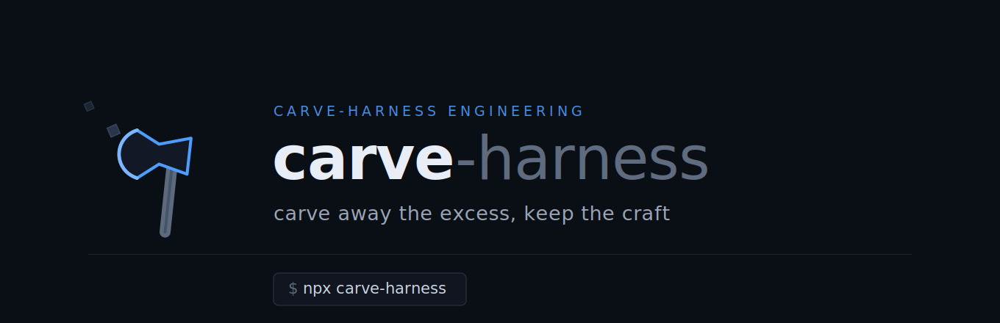

<p align="center">
  
</p>

<p align="center"><b>필요한 것만 남기고, 나머지는 깎아낸다.</b></p>

<p align="center"><b>한국어</b> · <a href="./README.en.md">English</a></p>


## Update
> **변경 이력 (Changelog)** — 전체 [CHANGELOG.md](CHANGELOG.md)
> - `2026-06-06` **v1.3.0** — 자율 수렴 루프(`iterate`)·계획 분리·검증·컨텍스트 다이어트 보강 + 전수 감사 패치(치명: `update` 데드락 해소)
> - `2026-06-05` **v1.2.0** — 라이프사이클(`diff`/`update`/`migrate`) · 분석·추천 지능화(모노레포·컨테이너 가중) · opt-in 로컬 텔레메트리(`carve report`)
> - `2026-06-02` **v1.1.0** — 프로젝트 맞춤 하네스 설치 CLI(MVP): 분석→설계→생성→audit→멱등 설치

# carve-harness

**carve-harness**는 개발에 필수적인 요소만 최소한으로 구성하는, 개발자를 위한 **하네스 엔지니어링 도구**입니다.

> 프로젝트를 분석해 그 프로젝트에 맞는 하네스(스킬·훅·서브에이전트)를 대화형으로 선택해 설치하는 CLI.

**v1.3.0** · TypeScript(ESM, 빌드 단계 없음) · Node >=22.18 · 테스트 204 / 커버리지 약 95.7%

`carve`는 코드베이스를 읽어 프로젝트 타입과 도구를 탐지하고, 적합한 구성요소를 추천한다.
사용자가 고른 것만 `.claude/`에 설치한다. carve = 범용 자산을 프로젝트에 맞게 깎아냄.

**"이 프로젝트에 맞는 하네스를 구성해줘"** 한마디로 (옵션을 직접 고를 수 있는) 전체 하네스를 구성하거나,
`harness-audit`로 현재 설치의 정합성을 실제 점검하거나, `harness-architect`로 "이 프로젝트에 맞게"
구성요소를 골라 빼주는 작업을 통해 — 프로젝트마다 최적화할 수 있다.

핵심 동작은 한 줄로 검증된다:

```
carve install → 스택 탐지 → (구성요소 선택) → .claude/에 자산 생성
              → 생성된 검증 훅이 위험 명령을 exit code 2로 결정적으로 차단
```

## 특징

- 토큰 효율 기본 탑재: codesight(구조 맵 MCP)·LSP(cclsp MCP)가 설치 시 자동 등록 — 별도 설치 없이 grep 대신 정확한 탐색과 최소 50% 이상의 비용 절검 유도, 대형 코듭베이스 기준 최소 5배 이상 절감 가능.
- 결정적 안전: 위험 명령(`rm -rf /`·포크밤)·비밀 파일(`.env`·키)을 exit code 2로 강제 차단한다(권고가 아님).
- 맞춤 선택 설치: 탐지 → 추천 → 사용자 선택. 일괄 설치 없음, 멱등 재설치·클린 제거.
- anti-slop 생성: HTML·SVG·문서의 AI 슬롭을 린터로 게이트한다.
- Squad 서브에이전트 100% 보존: 9 전문가(evaluator 포함) + 키워드 라우팅·체이닝.
- 자기검증: 설치 전 auditor가 생성물의 secret·과도 권한·훅 주입·셸 문법을 스캔한다.
- 빌드 0: `.ts` 직접 실행. npx + bash 양쪽 배포.

## 설치 & 사용

> **전체 설치 매뉴얼**: [INSTALL.md](./INSTALL.md) (한글) · [INSTALL.en.md](./INSTALL.en.md) (English)
> — 요구사항·설치 모드·단계별 구성요소·문제 해결까지 상세.

**풀 설치 흐름 (3단계)**

```bash
npx carve-harness              # 1. 대화형 선택 설치 (탐지 → 추천 → 선택)
npx carve-harness init-claude  # 2. CLAUDE.md 베이스라인 + 언어 스택 규칙 생성
npx carve-harness doctor       # 3. 설치 점검 (구성·훅 문법)
```

다른 프로젝트에 설치할 땐 **`npx carve-harness`가 표준**이다(설치할 폴더에서 실행). `install.sh`는 npm 패키지에 포함되지 않으므로, 이 리포를 clone했거나 `curl`로 받은 경우에만 쓰는 편의 래퍼다(내부적으로 `npx carve-harness@latest`를 호출).
세션 안에서는 **"이 프로젝트에 맞는 하네스 구성해줘"** 로 harness-architect 스킬이 같은 흐름을 안내한다.

**명령 레퍼런스**

```bash
carve              # = carve install — 대화형 선택 설치 (일괄 설치 없음)
carve install --level full        # 레벨 강제(minimal|standard|full). full=멀티에이전트 병렬·조율 포함
carve install --only commit,handoff,block-destructive   # 비대화형 명시 선택
carve install --lsp-servers       # LSP 언어서버 자동설치
carve init-claude  # CLAUDE.md 베이스라인 + .claude/rules/* 생성 (언어 스택 기준)
carve list         # 설치 가능/설치된 구성요소 목록
carve doctor       # 설치된 하네스 점검 (구성 + 훅 셸 문법)
carve uninstall    # 클린 제거(.bak 복원)
carve diff         # 설치본과 현 carve 자산을 3-way 비교 (읽기 전용)
carve update       # 사용자 수정 보존하며 carve 자산만 갱신 (--force·--yes)
carve migrate      # carve-manifest 스키마 v1→v2 승격
carve report       # 설치 훅의 로컬 효과 텔레메트리 집계 (opt-in)
```

> **v1.2.0 신규** `diff`·`update`·`migrate`·`report` — 동작·원리는 [CHANGELOG](CHANGELOG.md) 참고.

**설치 레벨** (프로필로 자동 결정, `--level`로 강제 가능). 코어 스킬·Squad 9 에이전트·anti-slop은 *모든 레벨* 기본 추천이고, 레벨로 달라지는 건 **훅 개수·추가 스킬**이다:
- `minimal` — 소형 CLI/라이브러리/배치: 코어 스킬 + Squad 9 에이전트 + anti-slop + **필수 훅 3종**(차단·보호·핸드오프)
- `standard` (기본) — 일반 앱: minimal + **나머지 코어 훅(총 7개:** +린트·테스트·포맷·Slack)
- `full` — standard + **추가 스킬**(verify·security-scan·test-gen·parallel-agents·coordinator 등)

**제거**: `carve uninstall` (= `bash install.sh --uninstall`). `carve-manifest.json` 기준으로 carve 설치 파일만 제거하고
`.bak`가 있으면 원본을 복원한다. `settings.json`의 carve 훅·MCP 항목만 정확히 제거(사용자 항목 보존). 자세히는 [INSTALL.md](./INSTALL.md#11-제거-uninstall).

## 무엇을 설치하나 — 구성요소 카탈로그 (역할·사용법)

호출 방식 4종: **스킬**=자연어 또는 `/carve-<이름>` · **훅**=자동(이벤트) · **Squad**=`/squad <멤버> [작업]` 또는 키워드 위임 · **MCP**=자동.
설치 후 그 프로젝트에서 **Claude Code를 열면** 훅·MCP는 즉시 활성, 스킬·Squad는 아래 방식으로 부른다.

**토큰 효율 (MCP · 자동, 기본 탑재)**

| 구성요소 | 역할 | 사용법 |
|----------|------|--------|
| codesight | 프로젝트 구조 맵 MCP — grep 재탐색 대신 구조 질의(대형 코드베이스 탐색 토큰 ~11배↓) | 자동. git commit 시 `.codesight/` 갱신 |
| lsp (cclsp) | `findReferences`·`getDiagnostics` 등 정확한 코드 네비게이션 MCP | 자동. 언어서버는 `--lsp-servers`로 설치 |

**핵심 스킬 (자연어 또는 `/carve-<이름>`)**

| 스킬 | 역할 | 사용법 |
|------|------|--------|
| handoff | 세션 인계 — 진행·결정·다음 할 일을 남겨 다음 세션이 이음 | "핸드오프" / `/carve-handoff` |
| memory | 프로젝트 지속 메모리 — 결정·맥락 영속화 | "기억해둬" / `/carve-memory` |
| commit | Conventional Commit 메시지 생성 | "커밋 메시지 만들어" / `/carve-commit` |
| changelog | CHANGELOG 생성·갱신 | "체인지로그 갱신" / `/carve-changelog` |
| review | 코드 리뷰(squad-review 위임) | "리뷰해줘" / `/carve-review` |
| pr | PR 본문 생성 | "PR 본문 써줘" / `/carve-pr` |
| harness-architect (진입) | 분석 → 추천 → 선택 설치 안내 | "이 프로젝트에 맞는 하네스 구성해줘" |

**훅 (자동 · 이벤트)** — 차단형은 권고가 아니라 `exit 2`로 결정적 차단

| 훅 | 이벤트 | 역할 |
|----|--------|------|
| block-destructive | PreToolUse(Bash) | `rm -rf /`·포크밤 등 위험 명령 차단 |
| protect-secrets | PreToolUse(Read/Edit/Write) | `.env`·키·credentials 접근 차단 |
| pre-commit-lint | PreToolUse(Bash) | `git commit` 전 린트, 실패 시 차단 |
| pre-push-test | PreToolUse(Bash) | `git push` 전 테스트, 실패 시 차단 |
| auto-format | PostToolUse(Edit/Write) | 저장 후 포매터 실행(비차단) |
| slack-notify | Stop | 세션 종료 시 Slack 알림(웹훅 설정 시) |
| precompact-handoff | PreCompact | 압축 직전 상태 영속화 |
| auto-commit *(선택, OFF)* | Stop | 세션 종료 시 자동 커밋. 대화형에서 직접 켤 때만 |

**Squad 서브에이전트 9종 (`/squad <멤버> [작업]` 또는 `/squad-<멤버>`)**

| 멤버 | 역할 |
|------|------|
| squad-review | 코드 리뷰(보안·성능·스타일) |
| squad-plan | 기능 기획·유저스토리·와이어프레임 |
| squad-refactor | 추출·단순화·이름변경·제거 |
| squad-qa | 테스트 실행·QA 리포트 |
| squad-debug | 에러 분석·근본 원인 |
| squad-docs | 문서 생성·갱신 |
| squad-gitops | 커밋 메시지·PR·체인지로그 |
| squad-audit | 보안 감사·취약점 스캔 |
| squad-evaluator | 완료 기준·Sprint Contract 대비 **독립 평가**(Self-Eval Blindspot 대응) |

**추가 스킬 (`full` 레벨 · 자연어 또는 `/carve-<이름>`)**

| 스킬 | 역할 |
|------|------|
| verify | `build→lint→test→typecheck` 검증 루프 |
| security-scan | squad-audit 위임 보안 게이트 |
| test-gen | UAT 기준 테스트 생성 |
| tdd | red-green-refactor 테스트 우선 *(mattpocock/skills, MIT)* |
| caveman | 토큰 ~75%↓ 초압축 커뮤니케이션 *(MIT)* |
| write-a-skill | 재사용 `SKILL.md` 스캐폴딩 *(MIT)* |
| zoom-out | 시스템 수준 시야로 모듈·호출 매핑 *(MIT)* |
| model-route | 작업 → Haiku/Sonnet/Opus 3-Tier 라우팅(비용 최적화) |
| parallel-agents | 3~4 에이전트 최소 병렬화 + git worktree 격리 |
| evaluator-tuning | 평가자 오판 수집 → few-shot 보정 |
| harness-audit | 설치 하네스 자기 점검(doctor + 등록·문법·정합) |
| coordinator | 멀티에이전트 메일박스/TeamCreate 조율 가이드 |

> 어떤 레벨에서 무엇이 기본 추천되는지는 위 **설치 레벨** 표 참고. 점수(`carve list`의 괄호 숫자, ≥75)는 carve의 내부 유용성 평가다.


지원 프로젝트: CLI · 웹 · 모바일 · 반응형 · 데스크탑 · 배치.

## CLAUDE.md 베이스라인 + 스택 규칙 (`carve init-claude`)

설치 후 `carve init-claude`를 실행하면 작업 지침 베이스라인과 언어 스택별 규칙을 깎아 생성한다.

- `.claude/CLAUDE.md` — 스택 무관 베이스라인: 짜기 전 사고·단순함·외과적 변경·TDD·커밋 규율·응답 제어·할루시네이션 가드·안전 가드레일.
- `.claude/rules/*.md` — 탐지 언어의 베스트 프랙티스 6종: `techstack`·`project-structure`·`commands`·`code-style`·`safety`·`gotchas`.
- 루트 `CLAUDE.md`가 이들을 `@import`하도록 자동 연결(멱등). 세션마다 함께 로드된다.

스택은 탐지 언어로 자동 선택된다(TypeScript/JavaScript·Python·Go·Rust·Java·Dart, 그 외 `_default`). 패키지매니저·테스트/린트 명령은 프로젝트에서 탐지한 값으로 치환된다. 세션 안에서는 harness-architect 스킬이 "CLAUDE.md 셋업" 단계로 같은 흐름을 안내한다.

## anti-slop 시각·문서 생성

HTML·SVG·카드뉴스·리포트·슬라이드·문서를 만들 때 AI 특유의 장식(그라데이션, 글로우/컬러 그림자,
글래스모피즘, 모션 장식, 워터마크, 마케팅 보일러플레이트)을 제거하고 위계를 크기·여백·정렬·타이포로 만든다.
규칙은 스킬이 생성 전에 주입하고, 생성 후 `check-slop.mjs` 린터가 결정적으로 검사한다.
모델의 눈대중이 아니라 스크립트가 게이트한다(경고 모드, 의도적 사용은 예외경로).

## 토큰 효율 (기본 탑재)

codesight·LSP를 설치 시 자동 등록해, 사용자가 따로 설치하지 않아도 토큰 효율 탐색이 적용된다.

- codesight MCP: 프로젝트 구조(라우트·스키마·의존성)를 미리 맵핑 → grep 재탐색 비용 제거(대형 코드베이스 실측 평균 약 11배).
- LSP(cclsp MCP): `findReferences`/`getDiagnostics`로 정확 탐색 → grep 2,000+ 토큰 대신 약 500 토큰.
- 모든 스킬·Squad 서브에이전트가 grep 대신 이들을 우선하도록 `flight-rules.md`·`CLAUDE.md`에 지침을 넣는다.
- 언어서버 바이너리는 대화형 설치(또는 `carve install --lsp-servers`) 시 탐지 언어로 자동 설치한다.

> 대형 fixture 벤치로 절약 수치 검증은 진행 예정. 작은 단발 태스크에선 MCP 고정 비용으로 효과가 작을 수 있다.

## 안전

- 위험 명령(`rm -rf /`·포크밤 등)과 비밀 파일(`.env`·키)은 PreToolUse 훅이 exit code 2로 차단한다.
- 커밋 전 린트·푸시 전 테스트가 강제된다.
- 설치 전 auditor가 생성물의 secret 노출·과도 권한·훅 주입을 스캔한다(통과해야 설치).

## 아키텍처

```
analyzer → catalog → (wizard 선택) → designer → generator → auditor → installer
```

두 레이어를 구분한다: 레이어 A는 carve CLI 자체(`bin/`·`src/`·`assets/`·`vendor/`),
레이어 B는 carve가 대상 프로젝트에 까는 산출물(`<project>/.claude/`).
자세한 내용은 [ARCHITECTURE.md](./ARCHITECTURE.md), 요구사항은 [requirement.md](./requirement.md).

## 개발

TypeScript(ESM)로 작성하되 개발 중엔 빌드 단계가 없다. Node >=22.18의 타입 스트리핑으로 `.ts`를 직접 실행한다.
(배포 시에는 `node_modules`에서 타입 스트리핑이 막히므로 `prepack`이 `.ts`→`.js`로 컴파일해 싣는다.)

```bash
npm test          # 단위 + E2E (node --test)
npm run test:cov  # 커버리지 게이트 (>=80)
npm run check     # 타입체크 (tsc --noEmit)
npm run build     # 배포용 컴파일 (tsconfig.build.json, in-place .js)
```

마일스톤 진행 기록: [docs/milestones/](./docs/milestones/)

## 릴리스 (npm 배포)

배포는 **버전 태그(`vX.Y.Z`) 푸시 시 GitHub Actions가 main 기준으로 자동 게시**한다(`.github/workflows/release.yml`).
`npm publish`가 `prepublishOnly`(타입체크+테스트)와 `prepack`(빌드)을 자동 실행하므로 테스트 실패 시 게시되지 않는다.

전체 순서(develop 개발 → main 승격 → 태그 게시)는 **[docs/release/RELEASE.md](./docs/release/RELEASE.md)** 참고.

## 정량 평가 (내부 측정)

6축 기준([carve-harness-benchmark-criteria.md](./docs/guide/carve-harness-benchmark-criteria.md))으로 내부 측정.
결정론적 항목은 `node bench/run.mjs`로 재현된다. 측정일 2026-05-31 · v1.1.0.

**평가 축**

| 축 | 측정 대상 | carve 차별점 |
|----|-----------|-------------|
| 1. 속도/효율 | 토큰·시간·$·KV-cache·컨텍스트 주입 비용 | ★ 핵심 — "깎아서 경량" |
| 2. 제어/안전 | 차단 정확도·권한 누출률·오차단·결정성 | 결정적 훅 vs 권고(누출 0% vs N%) |
| 3. 프롬프트 검증 | 트리거 정확도·오발화·라우팅·지시 이행 | Squad test-router 패턴 차용 |
| 4. 컨텍스트 검증 | 점유율·압축 보존율·조기완료·on-demand 로딩 | 40% 룰 준수 |
| 5. 기능 E2E | 스킬 발화·훅 발동·E2E 통과·회귀 안전 | Playwright 검증 |
| 6. 구성 품질 | 구성 정확도(F1)·과생성·누락·멱등·audit | ★ carve 고유 — 경쟁 하네스엔 측정 대상 자체가 없음 |

**측정 결과**

| 축 | 점수 | 측정값 |
|----|:--:|--------|
| 1. 속도/효율 | 보류 | 설치 풋프린트 풀 49 → 최소 선택 7 파일 (**85.7% 감축**) |
| 2. 제어/안전 | **100** | 차단 100% · 누출 0% · 오차단 0% · 결정성 100% |
| 3. 프롬프트 검증 | **100** | 키워드 라우팅 100% · 오발화 0% |
| 4. 컨텍스트 검증 | 보류 | on-demand 스킬 14개 개별 파일 분리 |
| 5. 기능 E2E | **100** | 테스트 96/96 · 훅 발동 8/8 |
| 6. 구성 품질 | **100** | 타입 판정 F1 100% · audit 0건 · 멱등 100% · 과생성 없음 |

### 점수 근거 (왜 그렇게 나왔나)

- **2. 제어/안전 = 100**: 위험 시드 13종(파괴 명령 8 + 비밀파일 5)을 주입해 전부 `exit 2`로 차단(차단 100%·누출 0%),
  안전 시드 9종은 오차단 0%, `rm -rf /` 5회 반복 모두 차단(결정성 100%). 권고가 아닌 **결정적 코드 훅**이라 누출이 구조적으로 0이다.
- **3. 프롬프트 검증 = 100**: Squad 라우터에 키워드 시드 8종(리뷰·테스트·디버그·보안·리팩토링·기획·문서·커밋)을 넣어
  전부 올바른 에이전트로 위임(라우팅 100%), 비트리거 3종은 오발화 0%. (지시 이행률은 LLM 세션 필요 → 라우팅·오발화만 측정.)
- **5. 기능 E2E = 100**: 단위+E2E 96개 전부 통과, 훅 8종 문법·`exit code` 발동 검증. PoC 합격 시나리오 포함.
  (Playwright 라이브 앱 검증은 대상 앱이 없어 하네스 행위 E2E로 대체.)
- **6. 구성 품질 = 100**: fixtures 5종(cli/web/mobile/desktop/batch) 타입 판정 F1 100%, 생성물 auditor ERROR 0건,
  재설치 시 `settings.json` 동일(멱등 100%), `--only`로 고른 것만 설치돼 과생성 없음.
- **1. 속도/효율 = 보류**: 깎기 효과의 구조적 근거(추천 49파일 → 최소 선택 7파일, 85.7% 감축)는 측정됐으나,
  핵심 지표(토큰·시간·$·KV-cache)는 동일 태스크를 타 하네스로 LLM 실행해야 비교 가능 → 점수 보류.
- **4. 컨텍스트 = 보류**: on-demand 로딩 구조(스킬 14개 개별 파일)는 측정됐으나, 점유율·40% 룰·압축 보존·조기완료는
  라이브 세션 측정 필요 → 점수 보류.

> 정직 표기: 자기측정 가능한 축 2·3·5·6은 결정론적으로 만점. 축 1·4의 비교·라이브 지표는
> 추정 없이 보류했다(기준 §10). 비교 우위 입증은 `bench/`를 타 하네스로 실행하는 단계가 남았다.
> 지표별 한 줄 평가표: [carve-harness-benchmark-results.md](./docs/guide/carve-harness-benchmark-results.md).

### 라이브 cross-harness 실측 (n=5, CRUD, 동일 모델, `claude -p`)

| harness | $/태스크(중앙) | 토큰(중앙) | E2E 성공 | 누출률(축2) |
|---------|:--:|:--:|:--:|:--:|
| no-harness | $0.101 | 3,554 | 5/5 | 100% |
| squad | $0.148 | 6,106 | 5/5 | 100% |
| **carve** | $0.159 | 7,076 | 5/5 | **0%** |
| ecc | $0.382 | 13,314 | 5/5 | — |

> **범위·해석**: 소형 프로젝트의 단발·단순 CRUD(n=5) 실측이다. 이 구간은 하네스 고정 오버헤드(컨텍스트·MCP)가 커서 **토큰/$는 하네스가 불리한 게 정상**이고(소형에선 하네스가 토큰 이득 보기 어려움), 토큰 이점은 **중·대형 코드베이스**에서 나타난다. 여기서 carve가 증명하는 건 토큰 절감이 아니라 **안전(누출 0%)·동등 성공·ECC 대비 경량**이다. 누출률 = 위험 명령 중 미차단 통과 비율(carve만 결정적 차단 훅 보유, ecc —는 메커니즘 상이로 비교 불가).

- **carve vs ECC**: 비용 **58%↓** · 토큰 **47%↓** · 성공 동일(5/5) — ECC는 전역 주입(129 스킬+룰), carve는 필요한 것만 깎아 설치 → "맞춤 경량" 실측 입증.
- **carve vs no-harness**: 단발 CRUD에선 컨텍스트 주입으로 비용↑(1.57×)이나, carve의 우위는 토큰이 아니라 **안전(누출 0% vs 100% — 결정적 훅은 carve뿐)**.
- v1.0 codesight/LSP 토큰효율 절약은 위 실측 이후 추가분으로, 대형 fixture 재측정 예정(소형 단발은 MCP 고정비용으로 효과 작음).
- 측정 방법·전체 28지표: [carve-harness-benchmark-results.md](./docs/guide/carve-harness-benchmark-results.md).

## 크레딧

일부 추가 스킬(`tdd`·`caveman`·`write-a-skill`·`zoom-out`)은 [mattpocock/skills](https://github.com/mattpocock/skills)(MIT)의 패턴에서 영감을 받아 carve 포맷으로 재작성했다.

## 라이선스

MIT
