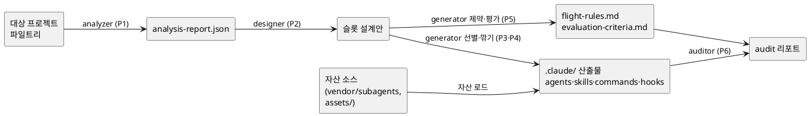

# ARCHITECTURE.md — carve-harness 아키텍처

> 대상: 구현·기여 개발자. 요구사항은 `requirement.md`, 개발 규칙은 `CLAUDE.md` 참조.

## 1. 두 레이어

```
[레이어 A] carve-harness 리포 — 개발·배포 대상 (CLI + vendor + assets)
[레이어 B] carve가 대상 프로젝트에 설치하는 .claude/ 산출물
```

A는 "공장", B는 "공장이 찍어낸 제품"이다. 이 문서는 주로 A의 내부 구조와 A→B 생성 흐름을 다룬다.

## 2. 컴포넌트

| 컴포넌트 | 입력 | 출력 | 책임 |
|----------|------|------|------|
| `installer` | 대상 프로젝트 경로 | `.claude/` 부트스트랩 자산 | `harness-architect` 스킬·커맨드 설치 |
| `analyzer` | 대상 프로젝트 파일트리 | 스택·구조 리포트(JSON) | 언어·프레임워크·테스트·CI·패키지매니저 감지 (읽기 전용) |
| `designer` | analyzer 리포트 | 하네스 슬롯 설계안 | OpenHarness 10서브시스템 분류로 필요한 슬롯 매핑 |
| `generator` | 슬롯 설계안 + 자산 소스 | `.claude/` 산출물 | 자산 선별 → 깎기 → 생성 |
| `auditor` | 생성 산출물 | audit 리포트 | 보안·권한·훅 주입 위험 스캔 |

## 3. vendor 참조 정책

| 대상 | 용도 | 접근 | 동기화 |
|------|------|------|--------|
| `vendor/openharness` | 분류 체계·확장점 패턴 참조 | 읽기 전용 | submodule 또는 핀 고정 subtree (OI-1) |
| `vendor/subagents` | Squad 자산 소스 | 복사 후 깎기 | subtree (원본 보존) |

> OpenHarness는 활발히 변경 중이므로(최근 활동 ~3일 전) 반드시 **핀 버전**으로 고정한다.
> 출처: https://github.com/HKUDS/OpenHarness

## 4. 자동 구성 파이프라인 (6단계)

### P1 — 도메인 분석 (analyzer)
- 감지 항목: 언어, 프레임워크, 테스트러너, 빌드/CI, 패키지매니저, 모노레포 여부, 디렉토리 구조
- 산출: `analysis-report.json` (메모리상)

### P2 — 하네스 슬롯 설계 (designer)
OpenHarness 10서브시스템을 슬롯 후보로 두고, 프로젝트에 필요한 것만 선택.

```
engine · tools · skills · plugins · permissions
hooks · commands · mcp · memory · coordinator
```

- 예: 테스트러너가 있으면 `qa` 에이전트 슬롯 + 테스트 검증 훅, raw SQL이 보이면 보안 flight-rule 슬롯

### P3 — 자산 선별 (generator)
- `vendor/subagents`의 Squad 8에이전트, `assets/`의 베이스 템플릿에서 **받을 것 / 안 받을 것** 결정
- 기준: 프로젝트에 실제 필요한 역할만 (불필요 자산은 깎아냄)

### P4 — 깎기·생성 (generator)
- 선별 자산을 프로젝트 컨벤션에 맞게 변형:
  - 에이전트 description에 프로젝트 규칙 주입 (프로젝트 오버라이드 패턴)
  - 도구 권한을 프로젝트 위험도에 맞게 하드 제약
- `.claude/agents/`, `.claude/skills/`, `.claude/commands/`에 생성

### P5 — 제약·평가 (generator)
- `flight-rules.md`: 금지/필수 규칙 (예: `any` 타입 금지, SQL 파라미터 바인딩 필수)
- `evaluation-criteria.md`: 평가 기준 (정량화 가능 항목)
- 검증 훅: `PreToolUse`(차단)·`PostToolUse`(포맷·린트), `.claude/settings.json` 등록

### P6 — 자기 검증 (auditor)
- 스캔: secret 노출, 권한 과다, hook injection, MCP 리스크, agent config
- 산출: audit 리포트 + 위험 항목 수정 제안

## 5. 데이터 흐름 (PlantUML — 복사해서 이미지로 렌더링)



## 6. 멱등성·병합 전략

- 생성 전 기존 `.claude/` 자산의 해시/마커 확인
- 사용자 수정 흔적이 있으면 덮어쓰지 않고 `.carve-proposed/`에 후보 생성 후 diff 제시
- carve가 생성한 파일에는 관리 마커(주석/frontmatter)를 남겨 재실행 시 식별

## 7. 확장점

OpenHarness의 4확장점(Tool·Skill·Plugin·Hook)을 그대로 차용한다. 새 자산 추가는 `assets/`에 베이스 템플릿을 두고 generator가 인식하게 하는 방식. 상세는 `CONTRIBUTING.md`.

---

## 할루시네이션 검증 노트
- OpenHarness 10서브시스템·4확장점은 github.com/HKUDS/OpenHarness 원문으로 확인.
- Squad 8에이전트·프로젝트 오버라이드 패턴은 프로젝트 내부 문서(7.1.4)로 확인.
- PlantUML은 문법만 작성(렌더 미확인). 멱등성·병합 세부 알고리즘은 설계 제안이며 구현 시 확정 필요.
