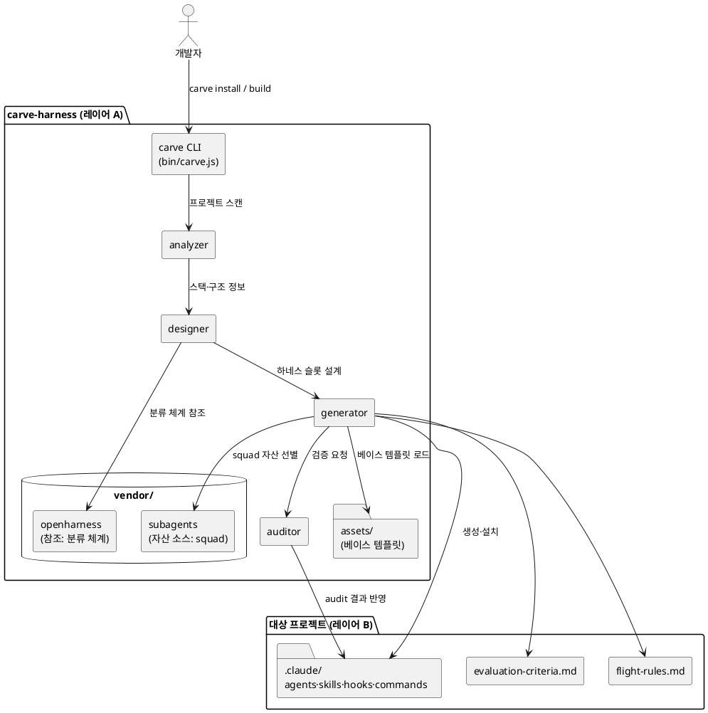
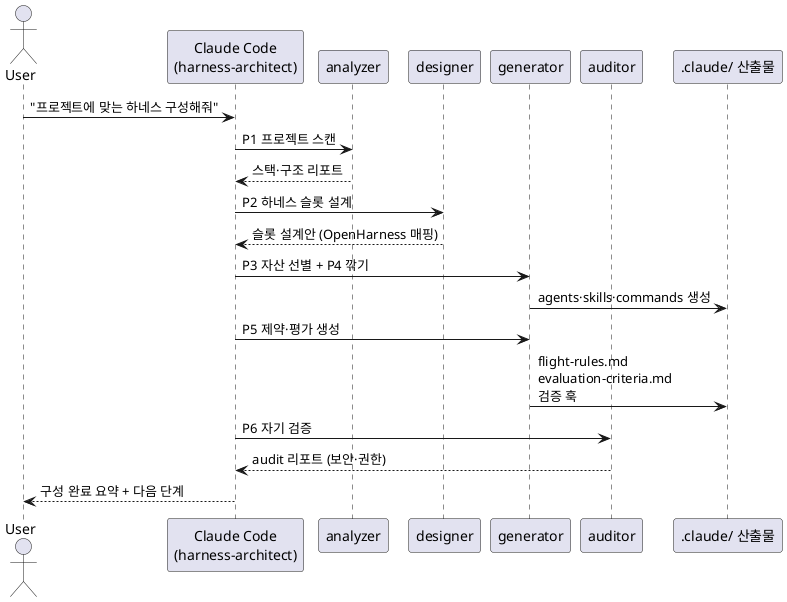

# carve-harness — 요구사항 명세서 (requirement.md)

> **한 줄 정의**: 아무 프로젝트에서 *"프로젝트에 맞는 하네스 구성해줘"* 한마디면, 범용 에이전트 자산을 그 프로젝트에 맞게 **깎아내어(carve)** 하네스(스킬·훅·커맨드·서브에이전트)를 자동 구성해주는 CLI 도구.
>
> | 항목 | 값 |
> |------|----|
> | 프로젝트명 | `carve-harness` (CLI 바이너리: `carve`) |
> | 문서 버전 | v1.1 |
> | 작성일 | 2026-05-31 |
> | 작성자 | CodeVillains (brewnet) |
> | 베이스 레퍼런스 | HKUDS OpenHarness, claude-code-expert/subagents (Squad), 공식 Anthropic Agent Skills |
> | 대상 | Claude Code를 실무에 적용하는 개발자 |

---

## 1. 개요와 비전

`carve-harness`는 **하네스 빌더(harness builder)** 다. 사용자가 만든 임의의 코드베이스를 분석해, 그 프로젝트에 최적화된 하네스 구성요소(스킬·훅·전용 커맨드·서브에이전트·평가 기준)를 자동 생성하고 `.claude/`에 설치한다.

핵심 메타포는 **carve(깎아내기)** 다. 하네스의 본질은 "에이전트의 불필요한 자유도를 깎아내 프로젝트 형상에 맞추는 것"이며, 이는 하네스 3기둥 중 **제약(Constraints)** 과 정확히 일치한다. 범용 자산(원목)을 받아 프로젝트 컨벤션에 맞게 깎아 전용 하네스(방망이)를 만든다.

```
범용 LLM + 범용 자산  ──[carve]──▶  프로젝트 전용 하네스
   (원목)                            (깎아 다듬은 방망이)
```

### 1.1 차별점 (squad와의 관계)

| 구분 | claude-code-expert/subagents (Squad) | carve-harness |
|------|--------------------------------------|---------------|
| 정체성 | 개별 전문 에이전트 (표면 에이전트) | 에이전트 팀을 **자동 편성·조율하는 빌더** |
| 산출물 | 8개 고정 에이전트 + 9커맨드 + 3훅 | 프로젝트별로 **동적 생성된** 하네스 일체 |
| 입력 | 사람이 직접 설치 | "프로젝트에 맞는 하네스 구성해줘" 한마디 |
| 자산 | 그 자체가 자산 | subagents를 **자산 소스로 참조**해 깎아 씀 |

---

## 2. 배경 / 문제 정의

단일 에이전트는 두 가지 실패 모드를 가진다 (Anthropic 엔지니어링 검증).

- **Context Anxiety**: 컨텍스트가 찰수록 품질 저하, 작업 조기 종료
- **Self-Evaluation Blindspot**: 자기 결과물을 과대 평가

해결책은 하네스(제약·피드백 루프·상태 관리)지만, **하네스를 프로젝트마다 수동으로 구성하는 비용이 크다.** 어떤 에이전트를 둘지, 어떤 훅으로 무엇을 강제할지, 평가 기준은 무엇인지를 매번 처음부터 설계해야 한다.

`carve-harness`는 이 구성 과정을 자동화한다. 검증된 자산(OpenHarness 분류 체계, Squad 에이전트 패턴, 공식 Skill 포맷)을 베이스로 삼아, 프로젝트를 분석해 맞춤 하네스를 깎아낸다.

> 출처: Anthropic, "Harness design for long-running application development" — https://www.anthropic.com/engineering/harness-design-long-running-apps

---

## 3. 목표 / 비목표

### 3.1 목표 (Goals)
- G1. `carve` CLI를 설치하면, 임의의 Claude Code 프로젝트에서 자연어 한마디로 하네스 자동 구성
- G2. 생성 산출물: 서브에이전트(`.claude/agents/`), 스킬(`.claude/skills/`), 훅(`.claude/settings.json` + `.claude/hooks/`), 전용 커맨드(`.claude/commands/`), 평가 기준(`evaluation-criteria.md`), 제약 규칙(`flight-rules.md`)
- G3. 리포 내부에 OpenHarness 소스와 subagents 코드를 **참조 가능한 벤더 디렉토리**로 포함
- G4. 멱등성: 재실행 시 기존 자산을 파괴하지 않고 병합/갱신
- G5. 생성된 하네스의 **자기 검증**(audit) 단계 포함

### 3.2 비목표 (Non-Goals)
- N1. OpenHarness/Claude Code 자체를 대체하지 않음 (그 위에서 동작)
- N2. 모델 호스팅·추론 엔진 구현하지 않음
- N3. v1.1에서는 비 Claude 에이전트(Codex 등) 호환 보장하지 않음 (확장 여지로만 둠)

---

## 4. 핵심 개념과 용어

| 용어 | 정의 |
|------|------|
| 하네스(Harness) | LLM을 기능하는 에이전트로 만드는 인프라 전체 (도구·지식·관찰·행동·권한) |
| 하네스 3기둥 | 제약(Constraints) · 피드백 루프(Feedback Loops) · 상태 관리(State Mgmt) |
| 자산(Asset) | 재사용 가능한 하네스 구성요소 (에이전트·스킬·훅·커맨드) |
| 깎기(Carve) | 범용 자산을 프로젝트 컨벤션에 맞게 잘라내고 다듬는 과정 |
| Flight Rules | 프로젝트별 강제 제약 규칙 (도구 차단·금지 패턴). 하네스의 "제약" 구현 |
| Evaluator | 생성물을 검증하는 독립 서브에이전트 (Self-Eval Blindspot 대응) |
| Progressive Disclosure | 스킬 메타데이터만 먼저 로드, 본문은 활성화 시 로드하는 3단계 컨텍스트 절약 패턴 |

---

## 5. 시스템 아키텍처

### 5.1 두 개의 레이어 (반드시 구분)

```
[레이어 A] carve-harness 리포 자체 — 개발·배포 대상
[레이어 B] carve가 대상 프로젝트에 설치하는 .claude/ 산출물
```

### 5.2 리포 디렉토리 구조 (레이어 A)

```
carve-harness/
├── package.json                # CLI 메타데이터 (bin: carve)
├── README.md
├── requirement.md              # (본 문서)
├── bin/
│   └── carve.js                # CLI 엔트리포인트 (#!/usr/bin/env node)
├── src/
│   ├── installer.js            # 대상 프로젝트에 자산 설치
│   ├── analyzer.js             # 프로젝트 스캔 (언어/프레임워크/테스트/CI 감지)
│   ├── designer.js             # OpenHarness 분류 체계로 하네스 슬롯 설계
│   ├── generator.js            # 스킬·훅·커맨드·에이전트 생성
│   └── auditor.js              # 생성물 자기 검증
├── vendor/                     # ★ 참조 전용 (G3)
│   ├── openharness/            # HKUDS/OpenHarness 소스 (분류 체계·패턴 학습용)
│   │   └── [git subtree 또는 submodule]
│   └── subagents/              # claude-code-expert/subagents 카피 (자산 소스)
│       ├── agents/             # squad-* 8개 에이전트 (자산 원본)
│       ├── commands/           # squad-* 9개 커맨드
│       └── hooks/              # squad-router 등 3개 훅
├── assets/                     # 생성기가 사용하는 빌딩블록 (깎기 전 원목)
│   ├── skills/                 # 베이스 SKILL.md 템플릿
│   ├── hooks/                  # 베이스 훅 스크립트
│   ├── commands/               # 베이스 커맨드 템플릿
│   ├── agents/                 # 베이스 에이전트 템플릿 (subagents 기반)
│   └── templates/
│       ├── evaluation-criteria.md
│       └── flight-rules.md
└── tests/                      # syntax 검증 + 설치 시나리오 테스트
```

> **vendor 포함 방식 권장**: `openharness`는 용량이 크고 외부 소스이므로 `git submodule` 또는 `git subtree`로 핀 고정(pinned). `subagents`는 자산 소스로 능동 활용하므로 `git subtree`로 카피해 내부에서 자유롭게 잘라 씀. (최종 방식은 오픈 이슈 OI-1 참조)

### 5.3 대상 프로젝트 산출물 구조 (레이어 B)

```
<user-project>/
├── .claude/
│   ├── agents/                 # carve가 생성한 프로젝트 전용 서브에이전트
│   ├── skills/                 # 프로젝트 전용 스킬 (SKILL.md)
│   ├── commands/               # 전용 슬래시 커맨드 (/carve-*, 프로젝트 커맨드)
│   ├── hooks/                  # 검증 훅 스크립트
│   └── settings.json           # 훅 등록 (PreToolUse/PostToolUse 등)
├── evaluation-criteria.md      # 프로젝트 품질 평가 기준
└── flight-rules.md             # 강제 제약 규칙
```

### 5.4 컴포넌트 관계 (PlantUML — 복사해서 이미지로 렌더링)



---

## 6. 기능 요구사항 (FR)

### FR-1. CLI 설치
- `carve` 바이너리는 npm 전역 설치(`npm i -g carve-harness`) 또는 원라인 스크립트로 설치
- `carve install` 실행 시 대상 프로젝트의 `.claude/`에 carve의 **부트스트랩 자산**(아래 FR-2의 트리거 스킬/커맨드)을 설치

```bash
# 설치 (예시)
npm i -g carve-harness        # 전역 설치
cd <user-project>
carve install                 # .claude/에 carve 부트스트랩 자산 설치
```

### FR-2. 자연어 트리거 — "프로젝트에 맞는 하네스 구성해줘"
- 설치 후, 대상 프로젝트의 Claude Code 세션에서 자연어로 트리거되는 **`harness-architect` 스킬**(또는 `/carve-build` 커맨드)을 제공
- 트리거 문구 예: "프로젝트에 맞는 하네스 구성해줘", "build a harness for this project"
- 트리거 시 FR-3의 자동 구성 파이프라인 실행

```yaml
# assets/skills/harness-architect/SKILL.md (발췌 — frontmatter는 공식 포맷 준수)
---
name: harness-architect
description: >
  프로젝트를 분석해 맞춤 하네스(에이전트·스킬·훅·커맨드·평가기준)를 자동 구성한다.
  사용자가 "프로젝트에 맞는 하네스 구성해줘", "build a harness for this project"
  라고 할 때 사용한다.
allowed-tools: Read, Glob, Grep, Write, Edit, Bash
---
```

> 공식 Agent Skills는 `name`·`description` frontmatter가 필수이며, description이 자동 트리거(Discovery)의 유일한 근거다.
> 출처: https://platform.claude.com/docs/en/agents-and-tools/agent-skills/overview

### FR-3. 자동 하네스 구성 파이프라인 (6단계)
revfactory/harness의 6-Phase 패턴과 강의 "나만의 하네스 만들기 9-STEP"을 종합한다.

| 단계 | 모듈 | 동작 |
|------|------|------|
| P1 도메인 분석 | `analyzer` | 언어·프레임워크·테스트러너·CI·패키지매니저·디렉토리 구조 감지 |
| P2 하네스 슬롯 설계 | `designer` | OpenHarness 분류 체계(10서브시스템)로 필요한 슬롯 매핑 |
| P3 자산 선별 | `generator` | `vendor/subagents`·`assets`에서 받을 것/안 받을 것 선별 |
| P4 깎기·생성 | `generator` | 선별 자산을 프로젝트 컨벤션에 맞게 잘라 `.claude/`에 생성 |
| P5 제약·평가 | `generator` | `flight-rules.md`·`evaluation-criteria.md` + 검증 훅 생성 |
| P6 자기 검증 | `auditor` | 생성물 audit (보안·권한·훅 주입 위험 스캔), 결과 리포트 |

### FR-4. 생성기(generator) 산출물 규격
- **서브에이전트**: frontmatter(name·description·tools·model·maxTurns) + 시스템 프롬프트. Squad 패턴(단일 책임·도구 권한 하드 제약·Pipeline 라인) 준수
- **스킬**: SKILL.md 3단계 Progressive Disclosure. 본문이 길면 `references/`로 분리
- **훅**: 결정적 검증은 `PreToolUse`(차단)·`PostToolUse`(포맷·린트). 핸드오프는 `PreCompact`+`SessionStart`
- **커맨드**: `/carve-*` 네이밍, `allowed-tools` 제한
- **flight-rules.md**: "금지/필수" 규칙 목록 (예: `any` 타입 금지, raw SQL 파라미터 바인딩 필수)

### FR-5. 멱등성·병합
- 재실행 시 기존 사용자 수정 자산을 덮어쓰지 않음
- 충돌 시 diff를 제시하고 병합 여부를 사용자에게 확인

### FR-6. vendor 참조 메커니즘 (G3)
- `analyzer`/`designer`는 `vendor/openharness`의 분류 체계·패턴을 **읽기 전용**으로 참조
- `generator`는 `vendor/subagents`의 squad 자산을 자산 소스로 사용 (복사 후 깎기)

### 6.1 파이프라인 시퀀스 (PlantUML — 복사해서 이미지로 렌더링)



---

## 7. 비기능 요구사항 (NFR)

| ID | 항목 | 요구 |
|----|------|------|
| NFR-1 | 안전성 | 생성 훅·커맨드는 secret 노출·hook injection·과도 권한을 audit에서 차단 |
| NFR-2 | 컨텍스트 효율 | 생성 스킬은 Progressive Disclosure 준수, 메타데이터 ≤ 약 100토큰 목표 |
| NFR-3 | 멱등성 | 재실행 시 사용자 수정 보존, 비파괴 병합 |
| NFR-4 | 호환성 | Claude Code 플러그인/스킬 표준 포맷 준수 (Node.js ≥ 18) |
| NFR-5 | 검증성 | 모든 생성 스크립트는 syntax 검증 통과(`bash -n`, `node --check`, JSON 파싱) |
| NFR-6 | 이식성 | macOS·Linux·WSL 지원 (OS별 알림은 osascript/notify-send/powershell 분기) |

---

## 8. 기술 스택

| 영역 | 선택 | 비고 |
|------|------|------|
| CLI 런타임 | Node.js ≥ 18 | squad-agents 배포 방식과 일관 |
| 패키징 | npm (`bin` 필드) | `npm i -g carve-harness` |
| 벤더 관리 | git submodule / subtree | openharness(핀), subagents(subtree) |
| 자산 포맷 | Markdown(SKILL.md·agent), JSON(settings), Shell(hooks) | Claude Code 표준 |
| 검증 | `node --check`, `bash -n`, `JSON.parse` | NFR-5 |
| 라이선스 | Apache-2.0 (제안) | 의존 소스 라이선스 확인 필요 (OI-2) |

---

## 9. 마일스톤 (제안)

1. **M1 — 스캐폴드**: 리포 구조, vendor 연결(openharness/subagents), `carve install` 부트스트랩
2. **M2 — analyzer + designer**: 프로젝트 스캔 + OpenHarness 슬롯 매핑
3. **M3 — generator**: squad 자산 깎기 → agents/skills/commands 생성
4. **M4 — 제약·평가·검증**: flight-rules·evaluation-criteria·검증 훅 + auditor
5. **M5 — 멱등성·병합 + 배포**: 비파괴 병합, npm 배포, CI(syntax 검증)

---

## 10. 리스크 / 오픈 이슈

| ID | 내용 | 상태 |
|----|------|------|
| OI-1 | vendor/openharness 포함 방식 (submodule vs subtree vs 부분 카피) 확정 필요 | 미결 |
| OI-2 | OpenHarness/subagents 라이선스 호환성 검토 (재배포 조건) | 미결 |
| OI-3 | `harness-architect`를 스킬로 할지 커맨드로 할지 — 자동 트리거 vs 명시 호출 | 미결 |
| OI-4 | 네이밍 점유 검증 (`carve-harness`·`carve` npm/GitHub) | 미결 |
| R-1 | OpenHarness가 활발히 변경 중(최근 활동 3일 전) → vendor 핀 버전 관리 필요 | 모니터링 |

---

## 11. 참고 자료 (검증 링크)

### Anthropic 공식
- Agent Skills 개요: https://platform.claude.com/docs/en/agents-and-tools/agent-skills/overview
- Harness design 엔지니어링 글: https://www.anthropic.com/engineering/harness-design-long-running-apps
- Effective context engineering: https://www.anthropic.com/engineering/effective-context-engineering-for-ai-agents
- 공식 스킬 리포(쿡북): https://github.com/anthropics/claude-cookbooks/tree/main/skills
- Claude Code 문서: https://code.claude.com/docs/en/overview

### 베이스 레퍼런스
- HKUDS OpenHarness: https://github.com/HKUDS/OpenHarness
- claude-code-expert/subagents: https://github.com/claude-code-expert/subagents
- revfactory/harness (자동 생성 패턴): https://github.com/revfactory/harness

### 오픈 표준
- Agent Skills 오픈 표준: https://agentskills.io/home (v1.0 2026 하반기 예정, 현재 draft)

---

## 12. 할루시네이션 검증 노트

- **검증됨 (1차 출처 교차 확인)**:
  - 공식 Agent Skills 3단계 Progressive Disclosure(Discovery→Activation→Execution), SKILL.md `name`·`description` 필수 — platform.claude.com 공식 문서
  - OpenHarness 10개 서브시스템·4확장점·PyPI `openharness-ai` 배포 — github.com/HKUDS/OpenHarness 원문
  - Squad 8에이전트·9커맨드·3훅, frontmatter 필드, Pipeline 라인 — 프로젝트 내부 문서(7.1.4~7.1.6)
  - 단일 에이전트 두 실패 모드, 하네스 3기둥 — 프로젝트 하네스 문서 + Anthropic 엔지니어링 글
- **미검증 (확정 전 확인 필요)**:
  - `carve-harness`·`carve`의 npm/GitHub 점유 여부 (OI-4) — `npm view carve-harness` 등으로 확인 필요
  - OpenHarness/subagents 재배포 라이선스 조건 (OI-2)
  - PlantUML 다이어그램은 문법 작성만 했으며 실제 렌더 이미지는 미생성 (사용자가 직접 붙여넣어 확인 필요)
- **버전 주의**: Claude Code hook 이벤트 수·커맨드 수 등은 버전에 따라 변동되므로, 구현 시점에 공식 CHANGELOG로 재확인 권장
