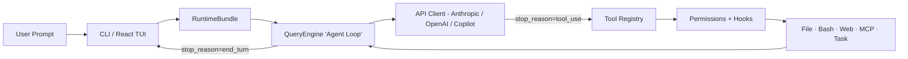

# Agent Harness Engineering — 이론과 실무 강의

> 본 자료는 홍콩대(HKUDS) **OpenHarness** 오픈소스 프로젝트(`HKUDS/OpenHarness`)의 코드베이스 분석을 바탕으로 작성되었습니다.
> 슬라이드 변환을 전제로, 모든 코드는 **의사코드(pseudocode)** 위주로 정리하고, 실제 동작 메커니즘과 설계 의도를 강조합니다.

---

## 0. 강의 로드맵 (한 장 요약)

```
Part 1.  Agent Harness란 무엇인가?              ← 이론
Part 2.  Harness 아키텍처 — 10개 하위 시스템    ← 구조
Part 3.  Agent Loop — 심장부 동작 메커니즘      ← 핵심 원리
Part 4.  설치 (Install) — 3단계 부트업          ← 실무
Part 5.  사용 (Use) — 대화형 / 헤드리스 / 드라이런
Part 6.  확장 (Extend) — Tool / Skill / Plugin / Hook
Part 7.  멀티 에이전트 — Coordinator 패턴
Part 8.  Harness 유무 비교 — 결과물 차이
Part 9.  전체 라이프사이클 정리
```

---

# Part 1. Agent Harness란 무엇인가? (이론)

## 1.1 핵심 정의

> **Agent Harness = LLM을 "기능하는 에이전트"로 만들기 위해 모델 주위를 감싸는 인프라 전체.**

```
모델(LLM)이 제공하는 것 :  지능 (intelligence)
하네스(Harness)가 제공하는 것 :  손 · 눈 · 기억 · 안전 경계
```

OpenHarness 프로젝트의 README가 정의하는 Harness 방정식:

```
Harness  =  Tools  +  Knowledge  +  Observation  +  Action  +  Permissions
            (도구)   (지식)        (관찰)         (행동)     (권한)
```

## 1.2 왜 Harness가 필요한가?

LLM을 단독으로 호출하면:

```python
response = llm.complete("이 버그를 고쳐줘")
# → 반환값: 텍스트뿐. 파일은 그대로. 검증된 것 없음.
```

LLM은 본질적으로 **다음 토큰 예측기**일 뿐, 다음을 **혼자 할 수 없다**:

| 모델이 못 하는 것 | Harness가 채우는 것 |
|---|---|
| 디스크 파일 읽기/쓰기 | File I/O Tool |
| 셸 명령 실행 | Bash Tool |
| 웹 검색 | Web Search/Fetch |
| 권한 위험 판정 | Permission Layer |
| 장기 기억 유지 | Memory + Context Compression |
| 다른 에이전트와 협업 | Coordinator/Swarm |
| 라이프사이클 이벤트 가로채기 | Hooks |

## 1.3 슬로건

> **"The model is the agent. The code is the harness."**
> (모델이 에이전트다. 코드는 하네스일 뿐이다.)

이것은 OpenHarness가 지향하는 철학을 함축한다 — **모델은 교체 가능**하다(Claude, GPT, Kimi, GLM, Gemini, Ollama 로컬…). 하네스는 모델 비종속이어야 한다.

---

# Part 2. Harness 아키텍처 — 10개 하위 시스템 (구조)

## 2.1 디렉터리로 본 전체 구조

```
openharness/
├── engine/         🧠 Agent Loop (query → stream → tool-call → loop)
├── tools/          🔧 43+ Tools (File · Shell · Search · Web · MCP)
├── skills/         📚 On-demand Knowledge (.md 파일 기반)
├── plugins/        🔌 Extension (commands · hooks · agents · MCP)
├── permissions/    🛡️ Safety (Mode · PathRule · DenyList · Sensitive)
├── hooks/          ⚡ Lifecycle Events (Pre/Post ToolUse · Stop · …)
├── commands/       💬 Slash Commands (/help · /commit · /resume …)
├── mcp/            🌐 Model Context Protocol Client
├── memory/         🧠 Persistent Cross-Session Memory (MEMORY.md)
├── coordinator/    🤝 Multi-Agent (subagent · team · swarm)
├── prompts/        📝 System Prompt 조립 (CLAUDE.md, env, skills 주입)
├── config/         ⚙️ 다층 설정 (settings.json · profile · migration)
└── ui/             🖥️ React/Ink TUI (terminal interactive UI)
```

## 2.2 Mermaid: 한 사용자 프롬프트의 흐름



핵심 통찰: **루프의 종료 조건은 모델이 결정**한다. Harness는 단지 "도구가 있는지", "권한이 있는지"만 판정한다.

## 2.3 각 하위 시스템 한 줄 요약

| 시스템 | 책임 | 주요 추상 |
|---|---|---|
| `engine` | Agent Loop, 스트리밍, 자동 압축 | `QueryContext`, `run_query()` |
| `tools` | 43+ 도구의 통일 인터페이스 | `BaseTool`, `ToolRegistry`, `ToolResult` |
| `skills` | 도메인 지식의 **on-demand 로딩** | `SkillDefinition` (`SKILL.md`) |
| `plugins` | 외부 확장(claude-code 호환) | `plugin.json` 디스커버리 |
| `permissions` | 도구 실행 가부 판정 | `PermissionChecker.evaluate()` |
| `hooks` | 라이프사이클 이벤트 인터셉트 | `HookEvent`, `HookExecutor` |
| `mcp` | 외부 MCP 서버 연결 | `MCPClient`, HTTP/STDIO transport |
| `memory` | 세션 간 영구 기억 | `MEMORY.md` + 본문 메모 파일 |
| `coordinator` | 멀티 에이전트 오케스트레이션 | `<task-notification>` XML |
| `prompts` | system prompt 동적 조립 | `build_runtime_system_prompt()` |

---

# Part 3. Agent Loop — 심장부 동작 메커니즘 (의사코드)

> 모든 하네스의 **단 하나의 핵심**은 이 루프다. 나머지는 모두 이 루프에 끼워넣는 부속품.

## 3.1 가장 단순한 형태

```python
while True:
    response = api.stream(messages, tools)
    if response.stop_reason != "tool_use":
        break                           # 모델이 끝났다고 판단
    for tool_call in response.tool_uses:
        result = harness.execute_tool(tool_call)
        messages.append(result)
    # 모델이 결과를 보고 다음 턴 결정
```

## 3.2 OpenHarness 실제 의사코드 (생산 수준)

`src/openharness/engine/query.py:run_query()` 의 흐름을 의사코드로 재구성:

```python
async def run_query(context, messages):
    turn_count = 0
    reactive_compact_attempted = False

    while context.max_turns is None or turn_count < context.max_turns:
        turn_count += 1

        # ── (1) 자동 압축: 매 턴 시작 시 토큰 임계치 확인 ──
        messages = await auto_compact_if_needed(
            messages,
            threshold = context.auto_compact_threshold_tokens,
            strategy_order = ["microcompact", "summarize_old"],
        )

        # ── (2) 모델 스트리밍 호출 ──
        try:
            async for event in api.stream_message(model, messages, tools):
                if event is TextDelta:    yield AssistantTextDelta(event.text)
                if event is RetryEvent:   yield StatusEvent("retrying...")  # 지수 백오프 자동
                if event is MessageDone:  final_message, usage = event.message, event.usage
        except PromptTooLong as e:
            # ── (2-a) 컨텍스트 초과 시 reactive compaction ──
            if not reactive_compact_attempted:
                reactive_compact_attempted = True
                messages = await auto_compact_if_needed(messages, force=True)
                continue
            yield ErrorEvent(...); return

        messages.append(final_message)
        yield AssistantTurnComplete(final_message, usage)

        # ── (3) 모델이 도구를 더 부르지 않으면 종료 ──
        if not final_message.tool_uses:
            await hooks.execute(HookEvent.STOP, payload)
            return

        # ── (4) 도구 호출: 1개면 순차, N개면 병렬 ──
        tool_calls = final_message.tool_uses
        if len(tool_calls) == 1:
            tool_results = [await execute_tool_call(context, tool_calls[0])]
        else:
            # 병렬: 하나가 실패해도 나머지 결과를 보존
            # (Anthropic API는 tool_use 블록마다 대응되는 tool_result가 없으면 다음 요청을 거부)
            raw = await asyncio.gather(
                *[execute_tool_call(context, tc) for tc in tool_calls],
                return_exceptions=True,
            )
            tool_results = [
                tc_to_result(tc, r)  # 예외도 ToolResultBlock(is_error=True)로 변환
                for tc, r in zip(tool_calls, raw)
            ]

        messages.append(user_message_with(tool_results))
        # 다시 (1)로
```

## 3.3 단일 도구 호출의 6단 파이프라인

`_execute_tool_call()` 의 의사코드:

```python
async def execute_tool_call(context, tool_call):

    # ── ① PreToolUse Hook ──
    pre = await hooks.execute(HookEvent.PRE_TOOL_USE,
                              {"tool_name": tool_call.name, "tool_input": ...})
    if pre.blocked:
        return ToolResult(error=pre.reason)

    # ── ② Schema Validation (Pydantic) ──
    parsed = tool.input_model.model_validate(tool_call.input)
    # 잘못된 인자면 모델이 에러 메시지 받고 다시 시도

    # ── ③ Permission Decision ──
    decision = permission_checker.evaluate(
        tool_name      = tool.name,
        is_read_only   = tool.is_read_only(parsed),
        file_path      = resolve_path(parsed),
        command        = extract_command(parsed),
    )
    if not decision.allowed:
        if decision.requires_confirmation:
            # 사용자에게 y/n 모달 표시 (TUI)
            confirmed = await permission_prompt(tool.name, decision.reason)
            if not confirmed: return ToolResult(error="denied by user")
        else:
            return ToolResult(error=decision.reason)

    # ── ④ Execute ──
    result = await tool.execute(parsed, ToolExecutionContext(cwd, metadata, ...))

    # ── ⑤ Output Offload (큰 결과는 디스크로) ──
    if len(result.output) > inline_limit:
        artifact_path = save_to_disk(result.output)
        result.output = preview + "[full saved to ...]"

    # ── ⑥ PostToolUse Hook ──
    await hooks.execute(HookEvent.POST_TOOL_USE,
                        {"tool_name": ..., "tool_output": ..., "tool_is_error": ...})
    return result
```

## 3.4 핵심 동작 원리 5가지

1. **Stop reason driven** — 모델의 `stop_reason`이 루프 제어. 하네스는 정책만 강제.
2. **Streaming first** — 텍스트는 토큰 단위 스트림, 사용자에게 즉시 노출.
3. **Parallel tool calls** — 한 응답에 N개 호출이 오면 `asyncio.gather`. 단, 하나라도 실패해도 모든 `tool_use`에 대응되는 `tool_result`가 있어야 API가 다음 턴을 받는다.
4. **Self-healing context** — `prompt too long` 감지 시 reactive compaction으로 자동 회복.
5. **Hook-permission-execute 3단** — 모든 도구 실행은 항상 동일한 3단을 거친다. 우회 경로 없음.

---

# Part 4. 설치 (Install) — 3단계 부트업

## 4.1 한 줄 설치

```bash
# Linux / macOS / WSL
curl -fsSL https://raw.githubusercontent.com/HKUDS/OpenHarness/main/scripts/install.sh | bash

# Windows (PowerShell)
iex (Invoke-WebRequest -Uri 'https://raw.githubusercontent.com/HKUDS/OpenHarness/main/scripts/install.ps1')

# pip
pip install openharness-ai
```

설치 스크립트가 하는 일 (의사코드):

```text
1. uv 또는 venv 생성
2. 패키지 설치 (openharness-ai)
3. ~/.local/bin 에 oh, ohmo, openharness 실행 파일 심볼릭 링크
   (※ Conda 환경 PATH를 깨뜨리지 않기 위해 prepend 대신 link 방식)
4. 셸 PATH 안내
```

## 4.2 프로바이더 설정 (Workflow 모델)

OpenHarness는 프로바이더를 **워크플로우 + 프로파일**의 2계층으로 추상화한다:

```
Workflow                        Profile (사용자 명명)
─────────────                   ──────────────────
Anthropic-Compatible API   ─→   claude-api,  kimi,  glm,  minimax, …
Claude Subscription        ─→   claude-cli  (~/.claude/.credentials.json)
OpenAI-Compatible API      ─→   openai,  deepseek,  groq,  ollama, …
Codex Subscription         ─→   codex      (~/.codex/auth.json)
GitHub Copilot             ─→   copilot    (OAuth device flow)
```

```bash
oh setup                # 인터랙티브 위저드 (워크플로우 선택 → 인증 → 모델 선택)
oh provider list        # 등록된 프로파일 나열
oh provider use <name>  # 활성 프로파일 전환
oh provider add ollama --base-url http://localhost:11434/v1 --model glm-4.7-flash:q8_0
```

## 4.3 첫 실행

```bash
oh                      # 대화형 React/Ink TUI
oh -p "이 코드베이스 설명해줘"  # 헤드리스 (한 번 실행 후 종료)
```

## 4.4 안전한 사전 검증 — Dry Run

```bash
oh --dry-run -p "이 PR 리뷰해줘"
```

`--dry-run` 의 동작 의사코드:

```text
- 모델 호출:        ❌ 안 함
- 도구 실행:        ❌ 안 함
- 서브에이전트 spawn: ❌ 안 함
- MCP 연결:         ❌ 안 함
- 설정 / 인증 / 프롬프트 / 매칭 가능한 skill·tool 해석: ✅ 함
- 결과 verdict:     ready · warning · blocked
- next_actions:     "oh auth login", "fix MCP config" 등 구체 제안
```

→ 환경 신뢰성을 빠르게 점검할 때 사용.

---

# Part 5. 사용 (Use) — 실무 시나리오별 사용법

## 5.1 대화형 모드 (Interactive)

```bash
oh
```

React/Ink TUI의 주요 인터랙션:

```
/         → Slash command picker (commands)
↑↓ Enter  → 명령 선택 / 제출
Shift+Enter → 줄바꿈
/permissions → Permission 모드 변경 (default / plan / full_auto)
/resume   → 이전 세션 복구
/agents   → 활성 서브에이전트 목록 / 상세
```

## 5.2 헤드리스 모드 (스크립트 / CI)

```bash
# 단일 프롬프트 → stdout
oh -p "어느 파일이 권한 시스템을 정의하는가?"

# JSON 출력 (programmatic)
oh -p "main.py 함수 목록" --output-format json

# 실시간 스트림 JSON (이벤트 단위)
oh -p "버그 수정해" --output-format stream-json
```

세 가지 출력 포맷의 차이:

| 포맷 | 형태 | 용도 |
|---|---|---|
| `text` | 사람용 평문 | 터미널 |
| `json` | 종료 후 단일 JSON 객체 | 스크립트 결과 파싱 |
| `stream-json` | 한 줄당 한 이벤트 (JSONL) | 진행상황 실시간 추적, 채팅 봇 |

## 5.3 권한 모드 3단계

| 모드 | 행동 | 사용 상황 |
|---|---|---|
| `default` | 쓰기/실행 도구는 사용자에게 묻고 진행 | 일상 개발 |
| `full_auto` | 모든 도구 자동 허용 | 샌드박스, 컨테이너, CI |
| `plan` | 모든 mutating 도구 차단, 읽기만 | 대규모 리팩터 사전 분석 |

`settings.json` 의 path-level 룰:

```json
{
  "permission": {
    "mode": "default",
    "path_rules": [
      {"pattern": "/etc/*",          "allow": false},
      {"pattern": "**/node_modules/*", "allow": false}
    ],
    "denied_commands": ["rm -rf /", "DROP TABLE *"]
  }
}
```

## 5.4 "절대 건드리면 안 되는 것" — 빌트인 민감 경로 보호

`PermissionChecker` 가 **사용자 설정과 무관하게** 항상 차단하는 패턴:

```python
SENSITIVE_PATH_PATTERNS = (
    "*/.ssh/*",                                  # SSH 키
    "*/.aws/credentials", "*/.aws/config",       # AWS
    "*/.config/gcloud/*",                        # GCP
    "*/.azure/*",                                # Azure
    "*/.gnupg/*",                                # GPG
    "*/.docker/config.json",                     # Docker
    "*/.kube/config",                            # K8s
    "*/.openharness/credentials.json",
    "*/.openharness/copilot_auth.json",
)
```

→ 프롬프트 인젝션으로 자격증명을 빼내려는 시도를 1차 방어. `full_auto` 모드도 이걸 우회 못 함.

## 5.5 Permission 평가 알고리즘 (의사코드)

```python
def evaluate(tool, *, is_read_only, file_path, command):
    # 1. 빌트인 민감 경로 → 무조건 차단
    if file_path matches SENSITIVE_PATH_PATTERNS:
        return Decision(allowed=False, reason="credential path")

    # 2. 명시적 deny / allow 리스트
    if tool in denied_tools:   return Decision(False, "denied")
    if tool in allowed_tools:  return Decision(True,  "allowed")

    # 3. path 룰 (사용자 설정)
    if file_path matches any deny path_rule:
        return Decision(False, ...)

    # 4. 명령 deny 패턴
    if command matches any denied_commands:
        return Decision(False, ...)

    # 5. 모드 기반 결정
    if mode == FULL_AUTO:    return Decision(True)
    if is_read_only:         return Decision(True)            # 읽기는 항상 허용
    if mode == PLAN:         return Decision(False, "plan mode blocks writes")
    # default: 사용자 확인 필요
    return Decision(allowed=False, requires_confirmation=True)
```

---

# Part 6. 확장 (Extend) — 4가지 확장점

OpenHarness는 4가지 명확한 확장점만 제공한다. 이게 전부다.

```
1.  Tool    — 새로운 도구 추가 (기능 확장)
2.  Skill   — 도메인 지식 추가 (.md 파일)
3.  Plugin  — 패키지화된 확장 (commands + hooks + agents)
4.  Hook    — 라이프사이클 이벤트 가로채기
```

## 6.1 커스텀 Tool 추가

모든 도구는 `BaseTool` 을 상속한다. 인터페이스는 단 4가지:

```python
class BaseTool:
    name: str
    description: str
    input_model: type[BaseModel]   # Pydantic ─ 모델은 이걸 보고 호출 시그니처 학습

    async def execute(self, arguments, context) -> ToolResult:    ...
    def is_read_only(self, arguments) -> bool: return False
    def to_api_schema(self) -> dict: ...   # Anthropic Messages API 포맷
```

의사코드 (40줄짜리 도구 정의):

```python
class MyToolInput(BaseModel):
    query: str = Field(description="Search query")

class MyTool(BaseTool):
    name = "my_tool"
    description = "Does something useful"
    input_model = MyToolInput

    async def execute(self, args, ctx):
        return ToolResult(output=f"Result for: {args.query}")

# 등록
registry.register(MyTool())
```

→ 등록 즉시 모델은 **JSON Schema 자동 생성**으로 도구 사용법을 학습한다. 별도 프롬프트 수정 불필요.

## 6.2 Skill 추가 (`SKILL.md`)

Skill은 **on-demand 지식 블록**이다. 모델이 명시적으로 `skill(name="...")` 을 호출할 때만 컨텍스트로 로드된다 → 토큰 절약.

```
~/.openharness/skills/<skill-name>/SKILL.md
```

`SKILL.md` 구조:

```markdown
---
name: my-skill
description: Expert guidance for my specific domain
---

# My Skill

## When to use
Use when the user asks about [your domain].

## Workflow
1. Step one
2. Step two
```

로딩 메커니즘 (의사코드):

```python
def load_skill_registry(cwd):
    registry = SkillRegistry()
    register_all(get_bundled_skills())                         # 1. 번들 (소스에 포함)
    register_all(load_from(get_user_skills_dir()))             # 2. 사용자
    register_all(load_from(extra_skill_dirs))                  # 3. CLI 인자
    for plugin in load_plugins(cwd):
        register_all(plugin.skills)                            # 4. 플러그인
    return registry

# system prompt 조립 시
"""
# Available Skills
- commit:   Create clean, well-structured git commits
- review:   Review code for bugs, security, quality
- debug:    Diagnose and fix bugs systematically
- plan:     Design an implementation plan before coding
- ... 40+ more
"""
# 모델은 이 목록만 항상 보고, 실제 본문은 skill() 호출 시점에 주입
```

## 6.3 Plugin (claude-code 호환)

`.openharness/plugins/<plugin>/.claude-plugin/plugin.json`:

```json
{
  "name": "my-plugin",
  "version": "1.0.0",
  "description": "My custom plugin",
  "tools_dir": "tools"
}
```

플러그인 디렉터리 레이아웃:

```
my-plugin/
├── .claude-plugin/plugin.json
├── commands/         # /<command> 형태 슬래시 커맨드
├── hooks/hooks.json  # 라이프사이클 훅
├── agents/           # 서브에이전트 정의
├── skills/           # SKILL.md
└── tools/            # BaseTool 서브클래스 (자동 디스커버리)
```

→ **공식 anthropic/claude-code 플러그인이 그대로 동작**. 12개 공식 플러그인 호환 검증됨.

## 6.4 Hook — 라이프사이클 이벤트

10개 라이프사이클 이벤트가 정의되어 있다:

```python
class HookEvent(str, Enum):
    SESSION_START      = "session_start"
    SESSION_END        = "session_end"
    PRE_COMPACT        = "pre_compact"
    POST_COMPACT       = "post_compact"
    PRE_TOOL_USE       = "pre_tool_use"
    POST_TOOL_USE      = "post_tool_use"
    USER_PROMPT_SUBMIT = "user_prompt_submit"
    NOTIFICATION       = "notification"
    STOP               = "stop"
    SUBAGENT_STOP      = "subagent_stop"
```

훅 종류 4가지:

| 종류 | 무엇이 실행되는가 | 용도 |
|---|---|---|
| `command` | 셸 명령 (subprocess) | linter, secret 스캔 |
| `http` | HTTP POST 요청 | Slack 알림, 로깅 SaaS |
| `prompt` | 또 다른 LLM 호출 (`{ok: bool}` 반환) | 가벼운 LLM 게이팅 |
| `agent` | LLM + 더 깊은 reasoning | 정책 위반 정밀 판정 |

훅 실행 의사코드:

```python
async def hooks.execute(event, payload):
    results = []
    for hook in registry[event]:
        if not matches(hook.matcher, payload):           # fnmatch (예: "Bash" 만 매칭)
            continue
        if hook is CommandHook:
            r = await run_subprocess(hook.command,
                                     env={"OPENHARNESS_HOOK_PAYLOAD": json(payload)})
        elif hook is HttpHook:
            r = await httpx.post(hook.url, json={"event": event, "payload": payload})
        elif hook is PromptHook | AgentHook:
            r = await ask_llm_for_strict_json(hook.prompt + payload)
            # 응답이 {"ok": true} 면 통과, {"ok": false, "reason": "..."} 면 차단
        results.append(r)
    return AggregatedResult(blocked = any(r.blocked for r in results))
```

훅이 **차단(blocked=True)** 을 반환하면 도구는 실행되지 않는다 → 프리커밋 훅처럼 작동.

---

# Part 7. 멀티 에이전트 — Coordinator 패턴

## 7.1 Coordinator vs Worker 구분

```
Coordinator (조율자)         Worker (실행자)
──────────────────         ──────────────
도구: agent, send_message,    도구: bash, file_*, glob, grep,
      task_stop                     web_*, task_*, skill, ...

역할: 분해 · 위임 · 종합        역할: 자율 실행 · 결과 보고
컨텍스트: 사용자 대화 전체       컨텍스트: 위임받은 프롬프트만
```

활성화:

```bash
export CLAUDE_CODE_COORDINATOR_MODE=1
oh
```

## 7.2 작업 위임 패턴 (의사코드)

```python
# Coordinator의 한 턴
agent(
    description = "Investigate auth bug",
    subagent_type = "worker",
    prompt = """
        Investigate src/auth/. Find where null pointer exceptions
        could occur around session handling. Report file paths,
        line numbers, types. Do not modify files.
    """,
)
agent(
    description = "Research auth tests",
    subagent_type = "worker",
    prompt = "Find all test files related to src/auth/...",
)
# 두 워커가 병렬 실행. Coordinator는 다음 사용자 메시지를 기다림
```

## 7.3 결과 전달 — `<task-notification>` XML 봉투

워커가 끝나면, Coordinator의 다음 user-role 메시지로 다음 XML이 도착한다:

```xml
<task-notification>
  <task-id>agent-a1b</task-id>
  <status>completed</status>
  <summary>Agent "Investigate auth bug" completed</summary>
  <result>Found null pointer in src/auth/validate.ts:42 ...</result>
  <usage>
    <total_tokens>3214</total_tokens>
    <tool_uses>7</tool_uses>
    <duration_ms>18230</duration_ms>
  </usage>
</task-notification>
```

→ Coordinator는 이걸 사용자 메시지가 아니라 **시스템 신호**로 인식 (절대 thank/acknowledge 하지 않음).

## 7.4 핵심 룰 — Continue vs Spawn

| 상황 | 메커니즘 | 이유 |
|---|---|---|
| 워커가 이미 그 파일들을 탐색했다 | **continue** (`send_message`) | 컨텍스트 재활용 |
| 탐색은 광범위, 구현은 좁음 | **spawn fresh** (`agent`) | 노이즈 제거 |
| 실패 정정, 후속 작업 | **continue** | 에러 컨텍스트 보존 |
| 다른 워커의 결과 검증 | **spawn fresh** | 가정 분리, 객관성 |
| 첫 시도가 잘못된 접근이었음 | **spawn fresh** | 잘못된 앵커 제거 |

## 7.5 절대 금기 — "Lazy Delegation" 안티패턴

```python
# ❌ BAD — 이해를 워커에게 떠넘김
agent(prompt="Based on your findings, fix the auth bug")

# ✅ GOOD — Coordinator가 종합한 구체 스펙
agent(prompt=
    "Fix the null pointer in src/auth/validate.ts:42. "
    "The user field on Session (src/auth/types.ts:15) is undefined "
    "when sessions expire but the token remains cached. "
    "Add a null check before user.id access — "
    "if null, return 401 with 'Session expired'. "
    "Commit and report the hash."
)
```

원칙:
> **"You never hand off understanding to another worker."**
> (이해는 절대 위임하지 않는다.)

---

# Part 8. Harness 유무 비교 — 결과물 차이

## 8.1 Naive LLM 호출 vs Harness 호출

| 차원 | Naive LLM | OpenHarness Harness |
|---|---|---|
| 입력 | 단일 프롬프트 | 프롬프트 + CLAUDE.md + skills + memory + env + tools schema |
| 출력 | 텍스트만 | 텍스트 + 파일 변경 + 명령 실행 + 검증된 결과 |
| 종료 결정 | 모델 응답 1번 | 모델의 stop_reason (반복적) |
| 안전성 | 없음 | 4중 (sensitive paths · path rules · deny commands · mode) |
| 컨텍스트 한계 | hard fail | auto-compact + reactive compact |
| 도구 실패 | 없음 (도구 없음) | 자동 재시도 + 에러를 모델에게 피드백 |
| 협업 | 없음 | Coordinator/Worker swarm |
| 재현성 | 낮음 | settings.json + plugin lock + skill 버전 |
| 외부 시스템 | 없음 | MCP (43+ 도구 + 외부 MCP 서버) |
| 라이프사이클 후킹 | 없음 | 10개 이벤트 × 4종 hook |

## 8.2 동일 과제, 두 환경의 결과 비교

**과제**: "이 레포에서 가장 위험한 버그를 찾아 고치고 관련 테스트를 돌려줘."

### Naive LLM (ChatGPT 단순 호출)

```
사용자: 위 명령
모델: "코드를 보내주세요"
사용자: <코드 첨부>
모델: "여기 수정안입니다 (텍스트)"
사용자: <붙여넣기 → 에디터 → 저장 → 테스트 실행>
모델: <테스트 결과 모름>

소요: 사람이 직접 수십 단계 수동 작업
검증: 사람이 직접
```

### OpenHarness

```
oh -p "Review this repo, identify the highest-risk bug, patch it,
       and run the relevant tests."

내부 동작:
  - grep / glob / read_file 으로 코드 탐색 (병렬)
  - 위험 후보 식별 → file_edit 으로 패치
  - bash 로 테스트 실행 → 결과 모델에게 피드백
  - 실패 시 재진단 → 추가 패치
  - PostToolUse hook 으로 lint / secret-scan 자동 실행
  - 자동 압축으로 긴 세션도 유지

소요: 한 명령
검증: 모델이 직접 (verifier worker도 추가 가능)
```

## 8.3 정량적 차이 (OpenHarness 측정값)

| 지표 | 값 |
|---|---|
| 내장 도구 수 | 43개 |
| 호환 플러그인 | 12개 공식 + 임의 |
| 라이프사이클 이벤트 | 10개 |
| 권한 모드 | 3개 |
| 지원 모델 패밀리 | 5개 워크플로우 (Claude / OpenAI / Copilot / Codex / Anthropic-compat) |
| 단위·통합 테스트 | 114건 통과 |
| E2E 스위트 | 6개 (실제 모델 호출 포함) |

## 8.4 "Harness 없는 결과물" 의 본질적 한계 5가지

1. **단발성** — 한 번의 응답으로 끝나는 고정된 사이클.
2. **무관찰** — 자기 행동의 결과를 보지 못함 (테스트 실패, 컴파일 에러 등).
3. **무경계** — 위험 명령과 안전 명령을 구분하는 메커니즘 없음.
4. **무기억** — 같은 사용자의 같은 패턴을 매번 새로 학습.
5. **단독성** — 협업 불가. 단일 LLM 단일 turn.

Harness는 이 5개를 모두 채우는 인프라다.

---

# Part 9. 전체 라이프사이클 정리 — 한 사용자 프롬프트가 들어오면

## 9.1 한 turn의 단일 라이프사이클 (시퀀스)

```
[1] User Prompt 입력
     ↓
[2] USER_PROMPT_SUBMIT hook 발동 (외부 정책 게이팅 가능)
     ↓
[3] System Prompt 동적 조립
     ├─ 베이스 프롬프트
     ├─ 환경 (OS, shell, cwd, git branch, date)
     ├─ Reasoning settings (effort, passes)
     ├─ Available Skills 목록 (이름 + description만)
     ├─ Delegation 안내
     ├─ CLAUDE.md (프로젝트 규약)
     ├─ Local rules (~/.openharness/rules)
     ├─ Issue / PR Comments / Repo Context 파일이 있으면 첨부
     └─ MEMORY.md + 관련 메모 (latest_user_prompt 기반 검색)
     ↓
[4] Auto-compact 체크 (토큰 임계 초과 시 microcompact / summarize)
     ├─ PRE_COMPACT hook
     ├─ 이전 tool_result 본문 축소
     └─ POST_COMPACT hook
     ↓
[5] API Streaming 호출 (Anthropic / OpenAI / Copilot 클라이언트)
     ├─ TextDelta → 화면 스트림
     ├─ RetryEvent → 지수 백오프
     └─ MessageDone → final_message + usage
     ↓
[6] stop_reason 분기
     ├─ end_turn → STOP hook → 종료
     └─ tool_use → 다음 단계
     ↓
[7] Tool Calls (1개 순차 / N개 병렬)
     for each tool_call:
        [7-a] PRE_TOOL_USE hook → block 가능
        [7-b] Pydantic 검증
        [7-c] Permission 평가 (sensitive → deny → allow → path → cmd → mode)
              └─ default mode + mutating → 사용자 모달
        [7-d] tool.execute()
        [7-e] 큰 출력 디스크 오프로드
        [7-f] POST_TOOL_USE hook
     ↓
[8] tool_results를 user role 메시지로 추가 → [4] 로 회귀
```

## 9.2 N턴이 흐른 뒤의 세션 상태

```
messages = [
    UserMessage,
    AssistantMessage(tool_uses=[...]),
    UserMessage(tool_results=[...]),
    AssistantMessage(tool_uses=[...]),
    UserMessage(tool_results=[...]),
    ...
    AssistantMessage(text="여기까지 마쳤습니다.", stop_reason=end_turn)
]
```

context.tool_metadata 에는 다음이 누적된다 (자동 압축 시 보존):

```python
{
    "task_focus_state":   {"goal": "...", "active_artifacts": [...], ...},
    "read_file_state":    [{path, span, preview, ts}, ...],          # 최근 6개
    "invoked_skills":     ["commit", "review", ...],                 # 최근 8개
    "async_agent_tasks":  [{agent_id, task_id, status}, ...],
    "recent_work_log":    [...],                                     # 최근 10개
    "permission_mode":    "default" | "plan",
}
```

→ **"Auto-Compaction preserves task state and channel logs across context compression"** (CHANGELOG v0.1.6).

## 9.3 마무리 — 강의 후 학습자가 그릴 수 있어야 하는 그림

```
                  ┌────────────────┐
        prompt →  │  System Prompt │  ← CLAUDE.md, skills, memory
                  └────────┬───────┘
                           ▼
                    ┌────────────┐
                    │ Agent Loop │ ←─────┐
                    └────────────┘       │
                           ▼              │
                  ┌────────────────┐     │
              ┌─→ │  LLM Stream    │     │
              │   └────────┬───────┘     │
              │            ▼              │
              │     stop_reason?          │
              │      ├─ end_turn → 종료   │
              │      └─ tool_use          │
              │            ▼              │
              │   ┌────────────────┐      │
              │   │ Tool Pipeline  │      │
              │   │  ① Pre-Hook    │      │
              │   │  ② Validate    │      │
              │   │  ③ Permission  │      │
              │   │  ④ Execute     │      │
              │   │  ⑤ Offload     │      │
              │   │  ⑥ Post-Hook   │      │
              │   └────────┬───────┘      │
              │            ▼              │
              │     tool_result ──────────┘
              └─────────── (다음 턴)
```

이 그림이 학습자의 머릿속에 그려지면 강의 목표 달성.

---

# 부록 A. 슬라이드 챕터 매핑 제안

| 슬라이드 챕터 | 본 자료 섹션 | 강의 시간 (가이드) |
|---|---|---|
| 1. Hook & Why | Part 1 | 10 min |
| 2. 아키텍처 한눈에 | Part 2 | 10 min |
| 3. 에이전트 루프 (실습 데모와 함께) | Part 3 | 25 min |
| 4. 5분 만에 설치 | Part 4 | 10 min |
| 5. 실무 사용 시나리오 | Part 5 | 20 min |
| 6. 확장 4종 (실습 권장) | Part 6 | 30 min |
| 7. 멀티 에이전트 패턴 | Part 7 | 20 min |
| 8. Harness 유무 비교 (Before/After 데모) | Part 8 | 15 min |
| 9. 라이프사이클 정리 + Q&A | Part 9 | 10 min |

총 약 **2시간 30분**.

---

# 부록 B. 추가 학습 포인트 (실무 심화)

- **MCP (Model Context Protocol)** — 외부 도구를 표준화된 스펙으로 가져오는 방법. HTTP/STDIO transport, auto-reconnect, JSON Schema 자동 추론.
- **Sandbox backend** — `sandbox.backend = "docker"` 로 도구 실행을 격리. 자원 제한, 네트워크 격리.
- **ohmo Personal Agent** — OpenHarness 위에 얹은 페르소나 에이전트(Telegram/Slack/Discord/Feishu). `~/.ohmo/soul.md`, `identity.md`, `user.md`, `BOOTSTRAP.md`.
- **Auto-compact trigger** — `auto` (임계 초과), `reactive` (모델이 prompt-too-long 던졌을 때), `manual` (사용자 `/compact`).
- **Output offload** — 도구 출력이 inline 한도를 넘으면 `~/.openharness/data/tool_artifacts/` 에 저장 후 프리뷰만 컨텍스트에 유지.

---

# 부록 C. 추천 데모 시나리오 (강의용)

1. **데모 1 — Hello, oh** (5분)
   `oh setup` → `oh` → 간단 프롬프트 → 도구 사용 모습 시각화

2. **데모 2 — 권한 충돌** (5분)
   default 모드에서 `rm -rf` 시도 → permission modal → `/permissions full_auto` → 자동 통과

3. **데모 3 — Plan Mode** (5분)
   `oh --permission-mode plan` → 동일 프롬프트 → 모든 mutating 차단되는 모습

4. **데모 4 — 커스텀 Skill** (10분)
   `~/.openharness/skills/code-style/SKILL.md` 작성 → 모델이 자동 인식 → `skill(name=...)` 호출 시 본문 주입

5. **데모 5 — Hook으로 Slack 알림** (10분)
   `hooks.json` 에 POST_TOOL_USE → `https://hooks.slack.com/...` HTTP 훅 → 도구 실행마다 Slack 채널에 기록

6. **데모 6 — Coordinator 모드 (3-worker swarm)** (15분)
   `CLAUDE_CODE_COORDINATOR_MODE=1 oh` → 한 프롬프트로 워커 3개 spawn → `<task-notification>` 도착 → 종합

7. **데모 7 — Dry Run으로 안전 점검** (5분)
   `oh --dry-run -p "..."` → ready/warning/blocked verdict 보여주기

---

> _End of Lecture Material_
